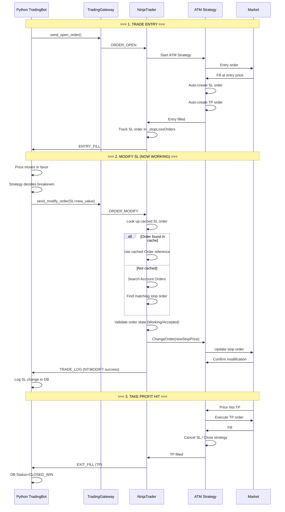

# Trade Lifecycle: Working SL Modification



## Key Implementation Details

### Stop Order Tracking
```csharp
// Dictionary to cache stop orders
private readonly Dictionary<string, Order> _stopLossOrders = 
    new Dictionary<string, Order>();

// Updated on every order update
OnOrderUpdate() {
    if (order.Name == "Stop") {
        _stopLossOrders[tradeId] = order;
    }
}
```

### Modification Flow
```csharp
HandleModifyOrder(tradeId, newSl) {
    // 1. Get cached order
    if (!_stopLossOrders.TryGetValue(tradeId, out stopOrder)) {
        // 2. Or search for it
        stopOrder = FindStopOrderForTrade(tradeId);
    }
    
    // 3. Validate
    if (stopOrder.OrderState != Working) return error;
    
    // 4. Modify using NinjaTrader API
    _account.ChangeOrder(
        stopOrder,
        stopOrder.Quantity,      // Same qty
        stopOrder.LimitPrice,    // Same limit
        newSl,                   // NEW stop price
        stopOrder.AtmStrategyId  // Keep ATM
    );
}
```

## Error Scenarios Handled

| Scenario | Response |
|----------|----------|
| Order not found | Search account orders, then error if still not found |
| Order not modifiable (Filled/Cancelled) | Error: "Stop order not modifiable" |
| ChangeOrder throws exception | Error logged + sent to Python |
| Account not connected | Error: "No account available" |
