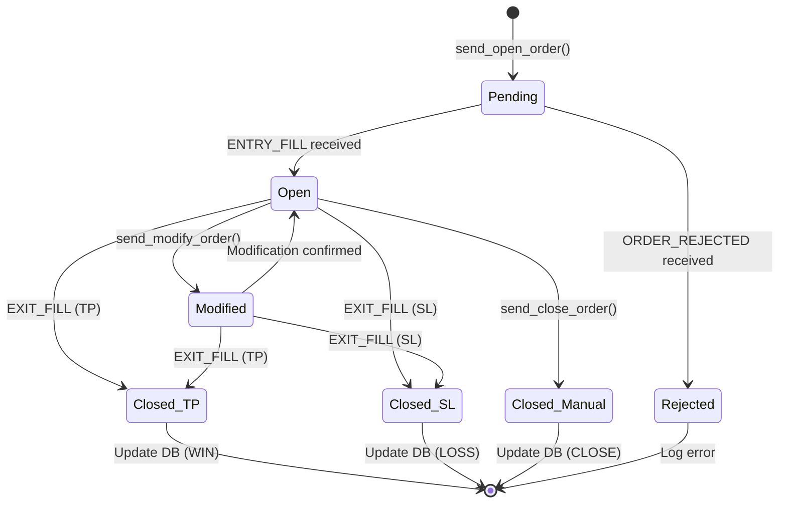

# Trade State Machine

```mermaid
stateDiagram-v2
    [*] --> Pending: send_open_order()
    
    Pending --> Open: ENTRY_FILL received
    Pending --> Rejected: ORDER_REJECTED received
    
    Open --> Modified: send_modify_order()
    Open --> Closed_TP: EXIT_FILL (TP)
    Open --> Closed_SL: EXIT_FILL (SL)
    Open --> Closed_Manual: send_close_order()
    
    Modified --> Open: Modification confirmed
    Modified --> Closed_TP: EXIT_FILL (TP)
    Modified --> Closed_SL: EXIT_FILL (SL)
    
    Closed_TP --> [*]: Update DB (WIN)
    Closed_SL --> [*]: Update DB (LOSS)
    Closed_Manual --> [*]: Update DB (CLOSE)
    Rejected --> [*]: Log error
```
