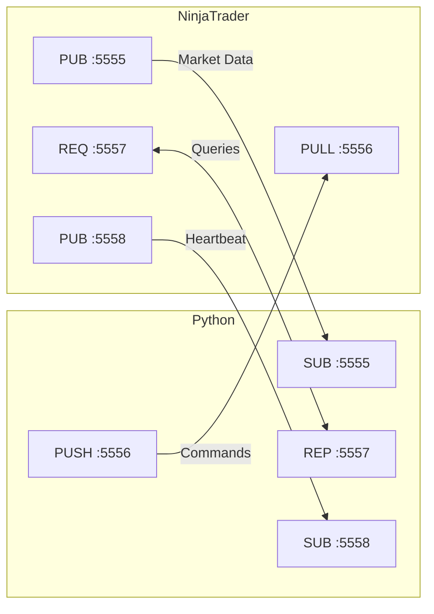

# Simple Socket Architecture

```mermaid
graph LR
    subgraph Python
        P1[SUB :5555]
        P2[PUSH :5556]
        P3[REP :5557]
        P4[SUB :5558]
    end
    
    subgraph NinjaTrader
        N1[PUB :5555]
        N2[PULL :5556]
        N3[REQ :5557]
        N4[PUB :5558]
    end
    
    N1 -->|Market Data| P1
    P2 -->|Commands| N2
    N3 <-->|Queries| P3
    N4 -->|Heartbeat| P4
```
