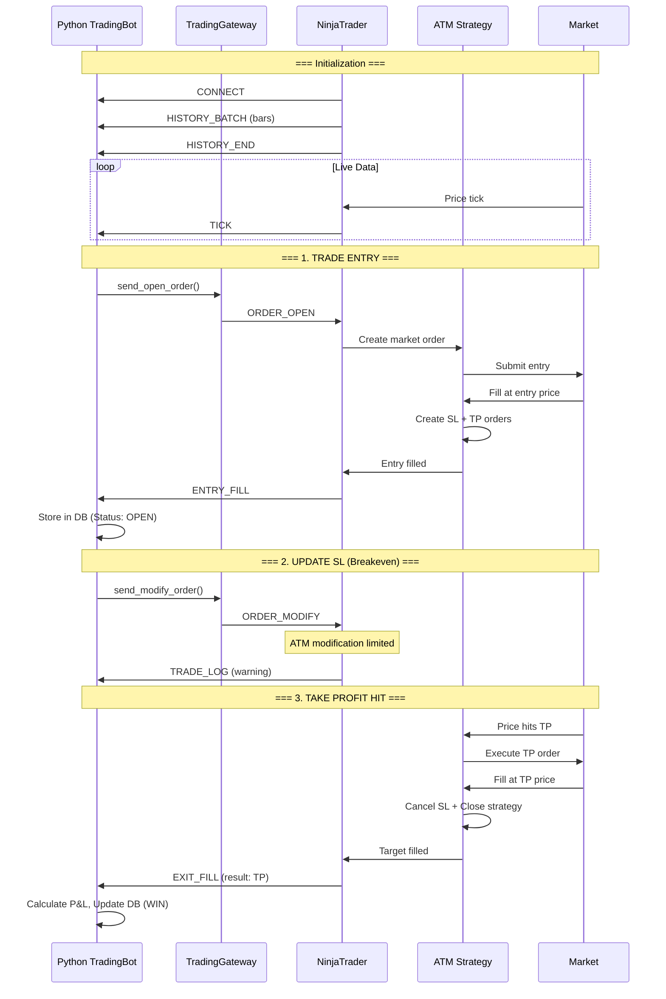

# Simple Trade Flow (Compatible Format)

```mermaid
sequenceDiagram
    participant PY as Python TradingBot
    participant GW as TradingGateway
    participant NT as NinjaTrader
    participant ATM as ATM Strategy
    participant MK as Market

    Note over PY,MK: === Initialization ===
    NT->>PY: CONNECT
    NT->>PY: HISTORY_BATCH (bars)
    NT->>PY: HISTORY_END
    
    loop Live Data
        MK->>NT: Price tick
        NT->>PY: TICK
    end

    Note over PY,MK: === 1. TRADE ENTRY ===
    PY->>GW: send_open_order()
    GW->>NT: ORDER_OPEN
    NT->>ATM: Create market order
    ATM->>MK: Submit entry
    MK->>ATM: Fill at entry price
    ATM->>ATM: Create SL + TP orders
    ATM->>NT: Entry filled
    NT->>PY: ENTRY_FILL
    PY->>PY: Store in DB (Status: OPEN)

    Note over PY,MK: === 2. UPDATE SL (Breakeven) ===
    PY->>GW: send_modify_order()
    GW->>NT: ORDER_MODIFY
    Note over NT: ATM modification limited
    NT->>PY: TRADE_LOG (warning)

    Note over PY,MK: === 3. TAKE PROFIT HIT ===
    MK->>ATM: Price hits TP
    ATM->>MK: Execute TP order
    MK->>ATM: Fill at TP price
    ATM->>ATM: Cancel SL + Close strategy
    ATM->>NT: Target filled
    NT->>PY: EXIT_FILL (result: TP)
    PY->>PY: Calculate P&L, Update DB (WIN)
```
