# Historical Bars Loading Sequence

This diagram shows the end-to-end flow from the browser opening the chart page through NinjaTrader loading historical bars, the Python backend warming up the strategy, and the frontend finally receiving live bars.

## Legend

- **FE** — Browser frontend (`ChartViewer`, `SocketHandler`, `DataService`)
- **Flask** — Flask/SocketIO server (`app_factory`, core routes, socket handlers)
- **DS** — `ZMQDataSource` (`src/infrastructure/gateway/datasource.py`)
- **Gateway** — `TradingGateway` (`src/infrastructure/gateway/gateway.py`)
- **RM** — `ReadinessMonitor` (`src/application/live_readiness/readiness_monitor.py`)
- **WO** — `WarmupOrchestrator` (`src/application/live_readiness/warmup_orchestrator.py`)
- **Strategy** — `LiquidityStrategyV2`
- **SM** — `ReadinessStateMachine`
- **NT** — NinjaTrader ZMQ connector (`zmq_connectors/ninjatrader/TradingBotZmqConnector.cs`)

```mermaid
sequenceDiagram
    autonumber
    actor User
    participant FE as Frontend (Browser)
    participant Flask as Flask / SocketIO
    participant DS as ZMQDataSource
    participant Gateway as TradingGateway
    participant RM as ReadinessMonitor
    participant WO as WarmupOrchestrator
    participant Strategy as LiquidityStrategyV2
    participant SM as ReadinessStateMachine
    participant NT as NinjaTrader

    %% Page load
    User->>FE: Open chart page /
    FE->>Flask: GET /
    Flask-->>FE: chart.html + JS bundles
    FE->>Flask: GET /api/pair
    Flask-->>FE: {pair: MNQ}
    FE->>FE: new ChartViewer(...)
    FE->>FE: new SocketHandler(socket, chart).init()

    alt Backtest mode
        FE->>Flask: GET /api/bars?tf=1m&start_time=null
        Flask->>DS: load_historical_bars("1m", None)
        DS-->>Flask: [...bars...]
        Flask-->>FE: [...bars...]
        FE->>FE: _displayChart(bars), historyReady = true
    else Live mode (no cached bars yet)
        Note right of FE: Defer /api/bars until history_loaded
    else Live mode (cached bars already exist)
        FE->>Flask: Socket.IO connect
        Flask->>DS: load_historical_bars("1m")
        DS-->>Flask: [...bars...]
        Flask-->>FE: emit history_loaded {bar_count, readiness_state, readiness_reason}
        FE->>Flask: GET /api/bars?tf=1m
        Flask-->>FE: [...bars...]
        FE->>FE: _displayChart(bars), historyReady = true
    end

    %% Gateway startup
    Note over DS,Gateway: App startup wired data_source.start()
    DS->>Gateway: gateway.start()
    Gateway->>NT: ZMQ sockets bind (5555/5556/5557/5558)

    %% NinjaTrader connects
    NT->>Gateway: connect seq=1 pair=MNQ
    Gateway->>DS: on_gateway_connection_change(true)
    DS->>DS: _state = CONNECTED
    DS->>DS: schedule delayed refresh (1s)
    Note right of DS: delay lets NT populate its cache

    %% Refresh request (only from platform connect, not browser connect)
    DS->>Gateway: send_refresh_request(days=1)
    Gateway->>NT: REFRESH_REQUEST seq=2
    NT-->>Gateway: command_ack seq=4
    Gateway-->>DS: command_ack
    NT->>Gateway: refresh_start seq=3
    Gateway->>DS: _on_refresh_start()
    DS->>DS: preserve bars older than 1 day, remove recent bars
    DS->>DS: _state = REFRESHING
    DS->>RM: on_refresh_start()
    RM->>SM: start_refresh()
    SM-->>RM: state = REFRESHING
    RM->>RM: _bar_buffer.clear()

    %% History batches
    loop History batches (one or many)
        NT->>Gateway: history_batch seq=N pair=MNQ bars=500
        Gateway->>DS: _on_history_batch(payload)
        DS->>DS: append unique bars to _historical_bars
    end
    NT->>Gateway: history_end seq=M
    Gateway->>DS: _on_history_end()
    DS->>DS: _state = STREAMING
    DS->>DS: flush bars buffered during refresh
    DS->>RM: on_history_complete(bars)

    %% Readiness monitor: history loaded
    RM->>SM: history_loaded()
    SM-->>RM: state = WARMING_UP
    RM->>Flask: socketio.emit("history_loaded", {readiness_state, readiness_reason, bar_count})
    Flask-->>FE: history_loaded event
    FE->>Flask: GET /api/bars?tf=1m&start_time=null
    Flask->>DS: load_historical_bars("1m", None)
    DS-->>Flask: [1020 bars]
    Flask-->>FE: [1020 bars]
    FE->>FE: _displayChart(bars), recalculateTSI(), shadeBars()

    %% Warmup
    RM->>WO: run(bars, "MNQ")
    loop For each historical bar
        WO->>Strategy: on_raw_bar(bar)
        Strategy->>Strategy: update indicator histories
    end
    WO->>Strategy: restore_trigger_states(pair)
    WO->>Strategy: restore_open_trades()
    WO->>Strategy: restore_reentry_opportunities(pair)

    %% Try warmup complete
    RM->>DS: check_history_completeness()
    DS-->>RM: (fresh?, reason)

    alt History is fresh (market open)
        DS-->>RM: (True, "OK")
        RM->>Strategy: warmup_policy.is_warm(strategy)
        Strategy-->>RM: True
        RM->>SM: warmup_complete()
        SM-->>RM: state = READY
        RM->>RM: _bar_buffer.flush()
        RM->>Flask: socketio.emit("trading_ready", {readiness_state, readiness_reason})
        Flask-->>FE: trading_ready event
        FE->>FE: liveMode = true, initBars() (refresh), flush pending bars
    else History is stale (market closed)
        DS-->>RM: (False, "Last bar is 567m old")
        Note right of RM: stays in WARMING_UP
        Note right of RM: no trading_ready emitted
    end

    %% Live bars
    alt Market open → live bars arrive
        NT->>Gateway: bar seq=X
        Gateway->>DS: _on_bar(payload)
        DS->>DS: insert bar into _historical_bars
        DS->>RM: on_live_bar(bar)
        RM->>SM: live_bar_received()
        SM-->>RM: state = LIVE
        RM->>RM: _live_bar_processor(bar)
        RM->>Strategy: on_raw_bar(bar)
        RM->>Flask: socketio.emit("bar", bar)
        Flask-->>FE: bar event
        FE->>FE: series.update(bar)
    else Market closed → no live bars
        Note over DS,RM: Heartbeat monitor detects no completed bar
        DS->>DS: after 90s log INFO (alert suppressed while market closed)
        DS->>DS: after 300s _market_is_open = False
        NT->>Gateway: market_status market_open=false
        Gateway->>DS: _on_market_status({market_open:false})
        DS->>DS: _market_is_open = false
    end
```

## Key state transitions

| Component | After event | State | Meaning |
|-----------|-------------|-------|---------|
| Data source | Platform connects | `CONNECTED` | NT is connected, refresh scheduled |
| Data source | `refresh_start` | `REFRESHING` | Old recent bars cleared, buffering live bars |
| Data source | `history_end` | `STREAMING` | Ingesting live messages; history is in cache |
| Readiness | `history_end` + non-empty | `WARMING_UP` | Historical bars cached, warmup replay running |
| Readiness | Fresh + warm | `READY` | Indicators ready; `trading_ready` emitted |
| Readiness | First live bar | `LIVE` | Live bar stream active |

## Frontend event behavior

| Socket.IO event | Frontend action |
|-----------------|-----------------|
| `history_loaded` | Calls `initBars()` to fetch and display cached historical bars; sets `historyReady = true` so buffered `bar` events can be processed. |
| `trading_ready` | Sets `liveMode = true`; calls `initBars()` again to refresh; flushes any pending bars. |
| `bar` | Updates candlestick series in real time. |

## Notes

- The `/api/bars` endpoint is **not** gated by readiness; it returns whatever is in `ZMQDataSource._historical_bars` at the time of the request.
- `history_loaded` is emitted both:
  - when a fresh history load completes, and
  - on Socket.IO connect if cached bars already exist.
  This lets the chart populate without an empty first fetch.
- `Socket.IO connect` no longer requests a refresh. Refreshes are triggered by platform connect or the explicit `request_refresh` event.
- `check_history_completeness()` requires the newest cached bar to be less than 60 seconds old. After market close this fails, so the readiness machine stays in `WARMING_UP`.
- The heartbeat monitor suppresses the ERROR alert when the market is reported closed. It still sets `_market_is_open = False` after 5 minutes to suppress duplicate-bar/gap warnings.
