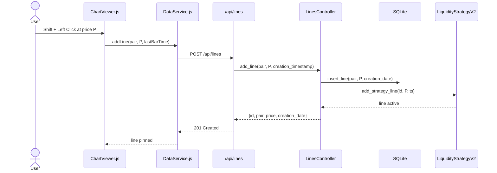
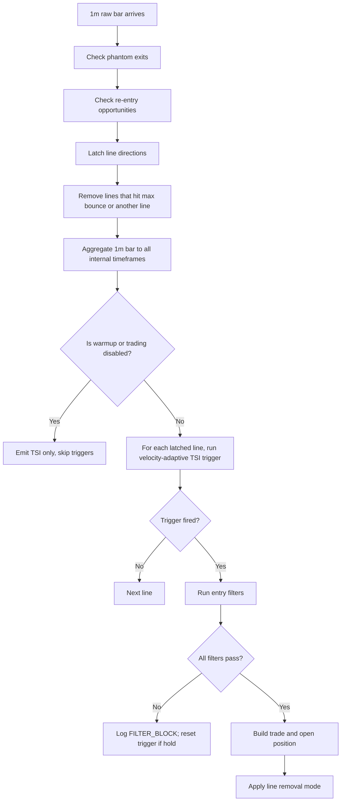
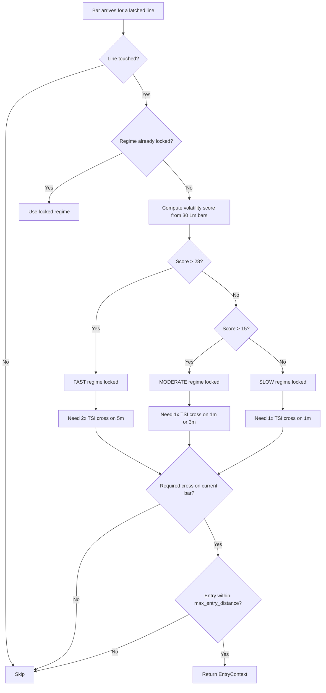

# Liquidity V2 Strategy — How the Bot Works

> This document explains the `liquidity_v2` trading strategy as it is **currently configured and running** in the TradingBot. It focuses on the Python strategy logic, the web-chart interaction, and the decision pipeline. Execution-layer details such as ZMQ, NinjaTrader, or MetaTrader wiring are intentionally left out.

---

## 1. What `liquidity_v2` Does

`liquidity_v2` is a **line-based, discretionary-automation** strategy:

1. The trader places horizontal "strategy lines" on the chart by **Shift+Clicking** at key support/resistance levels.
2. The bot watches price action around each line.
3. When price sweeps the line and a TSI (True Strength Index) confirmation fires, the bot enters a trade.
4. A stop-loss (SL) is derived from the structural extreme of the sweep, and a take-profit (TP) is derived from the configured risk:reward ratio.
5. After a losing trade, the bot can try one re-entry on the same line.

The strategy is intentionally defensive: most of the work is filtering out bad entries rather than finding entries.

---

## 2. Adding & Managing Strategy Lines

### 2.1 Shift+Click on the Chart

The chart is rendered with **Lightweight Charts** in `static/js/ChartViewer.js`.

| Action | Result |
|--------|--------|
| **Shift + Left Click** | Adds a new strategy line at the clicked price. |
| **Shift + Right Click** | Removes the nearest strategy line (within 1 % price tolerance). |

From `ChartViewer.js`:

```javascript
_onMouseDown(e) {
  if (!e.shiftKey || (e.button !== 0 && e.button !== 2)) return;
  const rect = this.chartElement.getBoundingClientRect();
  const price = this.series.coordinateToPrice(e.clientY - rect.top);
  if (e.button === 0) this._addLine(price);      // left-click  -> add
  else this._removeNearestLine(price);           // right-click -> remove nearest
}
```

When a line is added:

1. It is drawn immediately as a dotted blue price line.
2. `DataService.addLine()` sends a `POST /api/lines` request with `{ pair, price, creation_time }`.
   - `creation_time` is the timestamp of the last displayed bar, or `null` if no bar is loaded yet.
3. The backend persists the line and injects it into the live strategy.

When a line is removed:

1. The frontend finds the nearest line within 1 % of the click price.
2. It sends `DELETE /api/lines/<line_id>`.
3. The backend deletes it from the database and removes it from the strategy.

### 2.2 Backend Persistence

The backend flow is:

```
ChartViewer  --POST /api/lines-->  lines_routes.py  -->  LinesController.add_line()
                                                        |
                                                        v
                                            LineRepository (SQLite)
                                                        |
                                                        v
                                            LiquidityStrategyV2.add_strategy_line()
```

`LinesController` (`src/strategies/liquidity_v2/controllers/lines_controller.py`):

- Validates the price and creation timestamp.
- Resolves the line's creation date:
  - From the provided timestamp if available.
  - Otherwise from the bar loader's last played timestamp.
  - Otherwise from the current UTC time.
- Inserts the line into the database.
- Calls `liquidity_strategy.add_strategy_line(line_id, price, creation_timestamp)` so the strategy starts evaluating it immediately.

Existing lines are loaded on chart initialization via `GET /api/lines?pair=MNQ`.

### 2.3 Strategy Line State

Each line is stored in the strategy as a dictionary keyed by its UUID:

```python
self.strategy_lines[line_id] = {
    "level":       float,   # price level of the line
    "direction":   None | "long" | "short",
    "extreme":     float,   # lowest low (long) or highest high (short) since latch
    "creation_ts": float,   # epoch seconds when the line became valid
}
```

Additional trigger-specific keys are added at runtime (e.g. `vat_regime`, `vat_velocity`, `vat_5m_2x_stage`, `tsi_reset_occurred`).

---

## 3. Line Lifecycle

### 3.1 Direction Latch

When a line is added, `direction` is `None`. It becomes active only after price moves to one side of it.

On every 1-minute bar, `LiquidityStrategyV2.on_raw_bar()` evaluates each line:

```
if close < level and price penetrates min_cross_depth below level:
    direction = "short"
    extreme   = highest high seen while close was below the line
elif close > level and price penetrates min_cross_depth above level:
    direction = "long"
    extreme   = lowest low seen while close was above the line
```

- The latch records the **direction** the line is expected to trade.
- It also records the **extreme** — the worst price reached during the cross. This extreme is later used to size the stop-loss.
- If price was already on the correct side when the line was drawn, the line latches immediately.

A pending latch that has not yet reached `min_cross_depth` is logged as `LATCH_PENDING`. The line stays alive and can latch later.

### 3.2 Touch Tracking

After the line is latched, the strategy continues to track the extreme:

- **Long line:** `extreme` is updated to the lowest `low` seen.
- **Short line:** `extreme` is updated to the highest `high` seen.

When price touches or crosses back through the line, an `interaction_ts` and `touch_bar_time` are recorded. The velocity-adaptive trigger locks its regime at this touch bar.

### 3.3 Line Removal

A line can be removed for several reasons:

| Reason | Condition |
|--------|-----------|
| **Max bounce exceeded** | For a long line, `close < level - max_bounce`. For a short line, `close > level + max_bounce`. `max_bounce = 90.0` pts. |
| **Hit another line** | A short line is removed if price hits a higher short line; a long line is removed if price hits a lower long line. |
| **After evaluation** | Depends on `line_removal_mode` (see Section 9). |
| **Manual delete** | Shift+Right Click on chart or `DELETE /api/lines/<id>`. |

During warmup, lines with `creation_ts == 0` (legacy database lines) are protected from max-bounce removal so they survive live-mode startup.

---

## 4. Bar Aggregation & Timeframes

### 4.1 Incoming Data

The strategy receives **1-minute bars** through `on_raw_bar()`. These bars are assumed to be the smallest granularity the bot works with.

### 4.2 Internal Timeframes

`LiquidityStrategyV2` always maintains these internal aggregators:

- `1m`
- `3m`
- `5m`
- `15m`

It also aggregates any timeframes from the configuration (`cfg.timeframes`), which default to `["3m", "5m", "15m", "30m", "1h"]`.

On every 1m bar:

```
for each internal timeframe:
    determine the current window start
    if window start changed:
        aggregate the buffered 1m bars into one bar for the previous window
        append it to that timeframe's history
        call _on_strategy_bar(aggregated_bar)
    buffer the current 1m bar
```

Aggregation is done by `BarAggregator.aggregate_with_window()`: OHLC is built from the buffered 1m bars, and volume/time are set to the window start.

### 4.3 Why Multiple Timeframes?

The velocity-adaptive trigger needs different timeframes for confirmation:

- **1m bars** are used to compute the volatility score that selects the regime.
- **1m / 3m / 5m bars** are used for TSI cross confirmation depending on the regime.
- **15m** is available internally but is not directly used by the active trigger.

The chart emits TSI values for every configured timeframe so the frontend can display them.

---

## 5. TSI Indicator

### 5.1 Formula

The TSI implementation is in `src/strategies/indicators/tsi.py` with parameters **(6, 13, 4)**:

```python
def calculate_tsi_series(closes, long_len=6, short_len=13, sig_len=4):
    pc[i]     = close[i] - close[i-1]
    abs_pc[i] = abs(pc[i])

    ema_pc_2  = EMA(EMA(pc,     long_len), short_len)
    ema_apc_2 = EMA(EMA(abs_pc, long_len), short_len)

    tsi_values = 100 * ema_pc_2 / ema_apc_2
    signal_values = EMA(tsi_values, sig_len)

    return tsi_values, signal_values
```

- **TSI line** = blue line in the frontend.
- **Signal line** = orange/red line in the frontend.
- A cross happens when the TSI line crosses the signal line.

### 5.2 Cross Definition

A cross is detected on a closed bar by comparing the previous bar with the current bar:

```python
# Bullish cross
prev_tsi <= prev_sig and curr_tsi > curr_sig

# Bearish cross
prev_tsi >= prev_sig and curr_tsi < curr_sig
```

Only the **signal-line cross** is used. There is no zero-line cross logic in the current strategy.

### 5.3 Warmup Behavior

During warmup, TSI crosses are counted but not logged per bar. Once warmup ends, a summary is emitted:

```
[TSI] Warm-up complete: X cross(es) across Y bar(s)
```

After warmup, each cross is logged with the timeframe, close, TSI value, signal value, and cross direction.

---

## 6. Active Entry Trigger: Velocity-Adaptive TSI

The only trigger currently enabled in production is `make_velocity_adaptive_tsi_trigger()`.

### 6.1 Big Picture

The trigger measures how volatile price has been in the moments leading up to the line touch, classifies the move as **FAST**, **MODERATE**, or **SLOW**, and then demands a different TSI confirmation before entering.

The regime is **locked at the moment of line touch** and never re-evaluated.

### 6.2 Regime Selection

```
volatility_score = _calculate_volatility_score(history_1m, lookback=30)

if volatility_score > 28.0:
    regime = FAST
elif volatility_score > 15.0:
    regime = MODERATE
else:
    regime = SLOW
```

The volatility score is computed by grouping the last 30 one-minute bars into 5-minute chunks and summing `max(high) - min(low)` for each chunk, then dividing by 30. The result is an average bar-range per minute (pts/min).

The regime is determined from the perspective of the bar that actually touched the line (`touch_bar_time`), not from the current bar.

### 6.3 Confirmation Requirements

| Regime | Required TSI Confirmation |
|--------|---------------------------|
| **FAST** | 2 TSI crosses on the `5m` timeframe |
| **MODERATE** | 1 TSI cross on `1m` (with `3m` as fallback) |
| **SLOW** | 1 TSI cross on `1m` |

The fallback in MODERATE means: if the current bar is a `3m` bar and no `1m` condition fired, the `3m` condition is allowed to fire.

### 6.4 Single vs Double TSI Cross

- **Single cross (`count=1`):** the trigger fires immediately when a TSI cross in the trade direction is detected on the required timeframe.
- **Double cross (`count=2`):** used only in the FAST regime on `5m`.
  - Stage 0: wait for the first cross.
  - Stage 1: wait for TSI to reset (cross back against the trade direction).
  - Stage 2: wait for the second cross in the trade direction.
  - If price moves more than `post_cross1_max_dist = 80.0` pts away from the line after the first cross, the line is invalidated and removed.

### 6.5 Trigger Preconditions

Before evaluating TSI, the trigger checks:

1. The line has a latched direction.
2. The line has been touched (`interaction_ts` exists and is <= bar time).
3. For a long line, `extreme <= level` (price actually reached or went below the line).
4. For a short line, `extreme >= level`.
5. The entry price is not more than `max_entry_distance = 50.0` pts from the line.

If all preconditions pass, the trigger looks for the required TSI cross on the current bar's timeframe.

### 6.6 Entry Context

When the trigger fires, it creates an `EntryContext`:

```python
EntryContext(
    strategy=...,       # the strategy instance
    line_id=...,        # UUID of the strategy line
    direction=...,      # LONG or SHORT
    level=...,          # line price
    bar=...,            # aggregated bar that triggered
    close=...,          # bar close (entry price)
    low=...,            # bar low
    high=...,           # bar high
    extreme=...,        # structural extreme for SL sizing
    cross_depth=...,    # how far price penetrated the line
)
```

This context is then passed through the entry filter pipeline.

---

## 7. Entry Filters

All filters must pass for a trade to open. The production filter chain is defined in `src/strategies/liquidity_v2/prod_config.py`:

### 7.1 Open Trades Limit

```python
open_trades_limit_filter(1)
```

Blocks if 1 or more trades are already open. Only one open trade is allowed at a time.

### 7.2 Min Cross Depth

```python
min_cross_depth_filter(min_cross_depth=5.0)
```

Requires the price to have crossed the line by at least 5.0 pts. If not, the filter blocks but **holds the line alive** (`_hold_on_block = True`) so it can re-trigger if depth later becomes sufficient.

### 7.3 Max Bounce

```python
max_bounce_filter(max_bounce=90.0)
```

Blocks if the cross depth exceeds 90.0 pts. This prevents entering after an oversized liquidity sweep that has already moved too far.

### 7.4 Time Range

```python
time_range_filter("08:00", "15:30")
```

Only allows entries between 08:00 and 15:30 in the instrument's local timezone (America/New_York for MNQ/ES/etc.).

### 7.5 Daily Trades Limit

```python
daily_trades_limit_filter(max_trades_per_day=1)
```

Allows only one strategy trade per calendar day. Manual, test, and broker-sync trades are excluded from the count.

### 7.6 Rollover Filter

```python
rollover_filter(enabled=False)
```

Currently disabled. When enabled, it blocks entries on CME futures rollover days (the second Thursday before the quarterly expiration Friday).

---

## 8. Trade Construction

Once a trigger fires and all filters pass, `_build_trade_from_context()` creates the trade.

### 8.1 Stop-Loss Selection

The strategy uses **tiered stop-loss levels**: `[15.0, 20.0, 30.0, 40.0]`.

```python
distance_to_extreme = entry - extreme   # long
# or
distance_to_extreme = extreme - entry   # short

eff_risk = smallest sl_level where level + sl_level_tolerance >= distance_to_extreme
```

- `sl_level_tolerance = 3.0` prevents flickering between tiers.
- The selected SL can never be smaller than `min_stop_loss = 10.0` pts.
- If the distance exceeds all tiers, the largest tier (40.0) is used.

### 8.2 Take-Profit

```python
tp_distance = eff_risk * rr_ratio
```

With the default `rr_ratio = 5.0`, a 20-pt SL produces a 100-pt TP.

### 8.3 Position Sizing

```python
risk_per_contract = eff_risk * point_value
contracts = risk_budget / risk_per_contract
```

- `point_value = 2.0` for MNQ.
- `risk_budget` comes from either `risk_per_trade` (fixed $) or `risk_pct_per_trade` (% of account balance).
- If no risk is configured, the bot defaults to 1 contract (or 0.01 lots if fractional lots are enabled).

### 8.4 Trade Dictionary

The resulting trade contains:

```python
{
    "pair":         "MNQ",
    "type":         "long" | "short",
    "entry":        float,
    "stop_loss":    float,
    "orig_sl":      float,
    "take_profit":  float,
    "risk":         float,       # SL distance in points
    "risk_dollars": float,
    "risk_pct":     float | None,
    "contracts":    float,
    "rr_ratio":     5.0,
    "status":       "open",
    "entry_time":   int,
    "reentry_attempt": 0,
}
```

The trade is then persisted and emitted to the frontend and executor.

---

## 9. Line Removal Modes, Re-entry & Breakeven

### 9.1 Line Removal Modes

```python
class LineRemovalMode(str, Enum):
    ON_EVALUATE = "on_evaluate"   # remove line after it is evaluated
    ON_ENTER    = "on_enter"      # remove only if a trade was opened
    NEVER       = "never"         # keep line and reset state for future triggers
```

**Current default:** `ON_EVALUATE`.

This means after the strategy finishes evaluating a line on a bar, the line is removed regardless of whether a trade opened. Other modes are available but not currently used.

### 9.2 Re-entry After Stop-Loss

**Current default:** enabled (`reentry_after_sl=True`).

When a trade hits its stop-loss, the strategy creates a **re-entry opportunity**:

```python
{
    "level":            line_level,
    "direction":        trade_type,
    "pair":             pair,
    "extreme_excursion": extreme,
    "sl_bar_time":      exit_time,
    "reentry_attempt":  1,
}
```

On subsequent 1m bars, the strategy watches for price to return through the line:

- **Long re-entry:** price makes a bullish close above the line (`close > level` and `close > open`), and the adverse excursion below the line did not exceed `reentry_threshold = 90.0` pts.
- **Short re-entry:** price makes a bearish close below the line (`close < level` and `close < open`), and the adverse excursion above the line did not exceed 90.0 pts.

Re-entries bypass most filters and only check:

- `time_range_filter`
- `open_trades_limit_filter`
- `rollover_filter`

**Max re-entry attempts:** 1.

### 9.3 Breakeven

- **Normal trades:** no breakeven (`breakeven=None`).
- **Re-entry trades:** breakeven is enabled with `trigger_rr=2.0` and `move_to_rr=0.05`.
  - When unrealized RR reaches 2.0, the stop-loss is moved to entry + 0.05 × risk (a tiny profit).

This protects re-entry trades from giving back profits after a strong move.

---

## 10. End-to-End Flow Diagrams

### 10.1 Shift+Click Line Flow



### 10.2 Per-Bar Strategy Flow



### 10.3 Velocity-Adaptive Trigger Flow



---

## 11. Key Files & Configuration Reference

| File | Purpose |
|------|---------|
| `src/strategies/liquidity_v2/strategy.py` | `LiquidityStrategyV2` — bar aggregation, line latch, TSI emission, trigger/filter pipeline |
| `src/strategies/liquidity_v2/base_strategy.py` | `BaseLiquidityStrategy` — line state, trade construction, re-entry, breakeven, removal modes |
| `src/strategies/liquidity_v2/triggers.py` | Velocity-adaptive TSI trigger and helper functions |
| `src/strategies/liquidity_v2/prod_config.py` | Production `StrategyNumbers`, `StrategyOptions`, and trigger config |
| `src/strategies/liquidity_v2/config.py` | `StrategyNumbers` and `CandleConfig` dataclasses |
| `src/strategies/liquidity_v2/constants.py` | Default `StrategyOptions` values |
| `src/strategies/entry_context.py` | `EntryContext` and all entry filters |
| `src/strategies/indicators/tsi.py` | Pure TSI(6,13,4) calculation |
| `src/strategies/liquidity_v2/controllers/lines_controller.py` | Validates and persists chart lines, injects them into the strategy |
| `src/routes/lines_routes.py` | Flask routes for `/api/lines` |
| `static/js/ChartViewer.js` | Shift+Click line drawing and removal |
| `static/js/DataService.js` | Frontend API client for lines |
| `src/config/models.py` | `AppConfig` defaults including timeframes, re-entry, session times |
| `src/config/builder.py` | Wires production strategy options for backtest and live |

### 11.1 Tunable Parameters (Current Defaults)

| Parameter | Value | Where |
|-----------|-------|-------|
| `timeframes` | `["3m", "5m", "15m", "30m", "1h"]` | `src/config/models.py` |
| `line_removal_mode` | `ON_EVALUATE` | `src/strategies/liquidity_v2/constants.py` |
| `min_stop_loss` | `10.0` | `src/strategies/liquidity_v2/prod_config.py` |
| `max_bounce` | `90.0` | `src/strategies/liquidity_v2/prod_config.py` |
| `extra_sl_space` | `0.0` | `src/strategies/liquidity_v2/prod_config.py` |
| `sl_levels` | `[15.0, 20.0, 30.0, 40.0]` | `src/strategies/liquidity_v2/prod_config.py` |
| `sl_level_tolerance` | `3.0` | `src/strategies/liquidity_v2/prod_config.py` |
| `max_entry_distance` | `50.0` | `src/strategies/liquidity_v2/prod_config.py` |
| `min_cross_depth` | `5.0` | `src/strategies/liquidity_v2/prod_config.py` |
| `rr_ratio` | from `cfg.rr_ratio` | `src/config/models.py` |
| `point_value` | `2.0` | `src/strategies/liquidity_v2/prod_config.py` |
| `account_balance` | `100000.0` | `src/strategies/liquidity_v2/prod_config.py` |
| `session_start` / `session_end` | `08:00` / `16:58` | `src/config/models.py` |
| Time range filter | `08:00`–`15:30` | `src/strategies/liquidity_v2/prod_config.py` |
| `daily_trades_limit` | `1` | `src/config/models.py` and filter in prod_config |
| `max_open_trades` | `1` | `src/config/models.py` and filter in prod_config |
| `reentry_after_sl` | `True` | `src/strategies/liquidity_v2/prod_config.py` |
| `reentry_threshold` | `90.0` | `src/strategies/liquidity_v2/prod_config.py` |
| `max_reentry_attempts` | `1` | `src/strategies/liquidity_v2/constants.py` |
| `reentry_only` | `False` | `src/config/models.py` |
| `skip_rollover_days` | `False` | `src/config/models.py` |
| TSI parameters | `(6, 13, 4)` | `src/strategies/indicators/tsi.py` |
| Velocity fast threshold | `28.0` | `src/strategies/liquidity_v2/prod_config.py` |
| Velocity slow threshold | `15.0` | `src/strategies/liquidity_v2/prod_config.py` |
| Velocity lookback | `30` | `src/strategies/liquidity_v2/prod_config.py` |
| Post-cross-1 max distance | `80.0` | `src/strategies/liquidity_v2/prod_config.py` |

---

## 12. Summary

The `liquidity_v2` strategy is a disciplined, line-based system:

1. **You** draw the levels on the chart.
2. The bot **latches** a direction once price sweeps the line with enough depth.
3. It measures **volatility at the touch** and locks a confirmation regime.
4. It waits for a **TSI cross** on the appropriate timeframe.
5. A strict **filter pipeline** blocks bad entries (depth, bounce, time, daily limit, open trades).
6. If everything passes, it sizes the position, places SL/TP, and manages **re-entry** if the first attempt stops out.

By changing only the velocity thresholds and the TSI confirmation requirements per regime, the strategy adapts its confirmation strictness to how fast the market is moving at the line.
