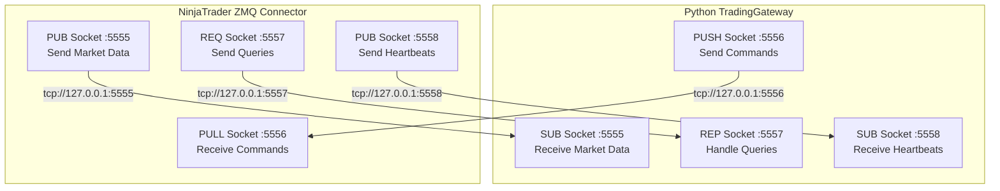
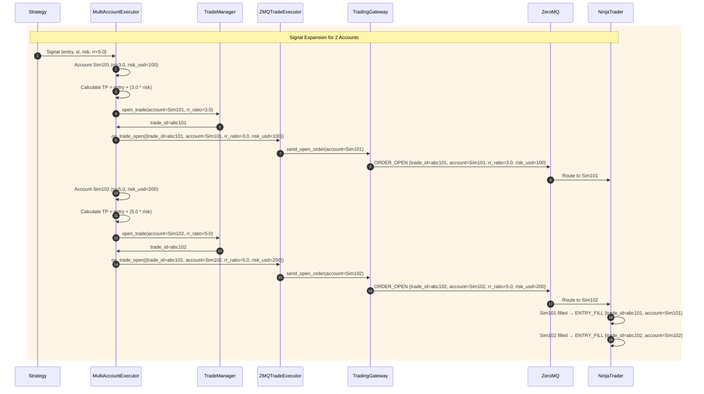
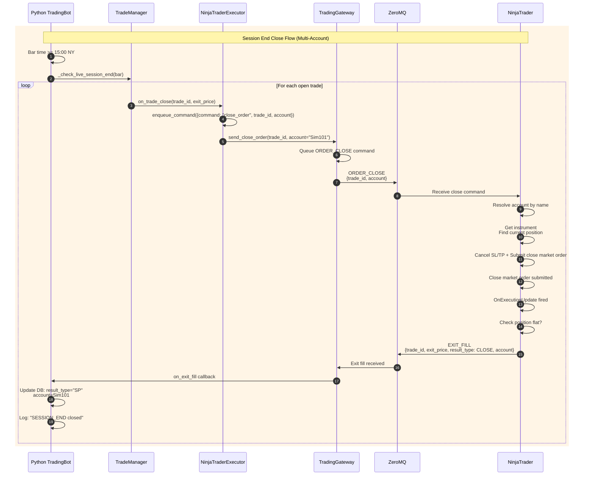
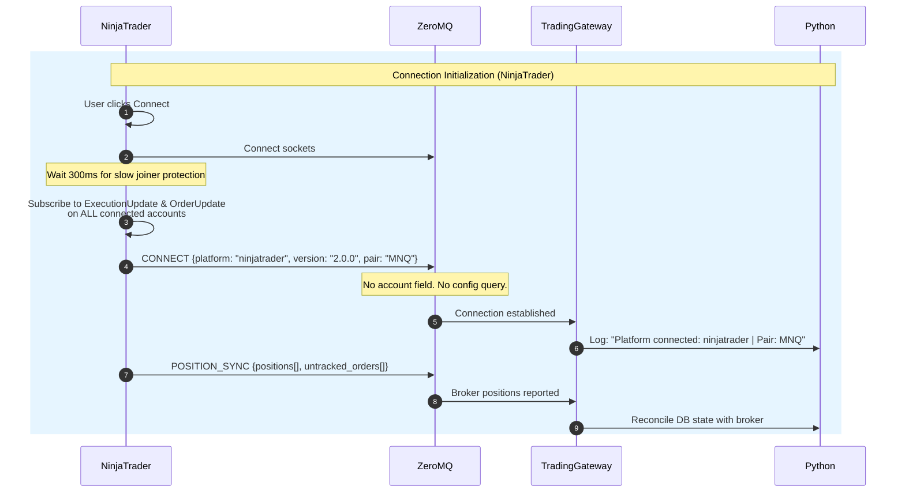
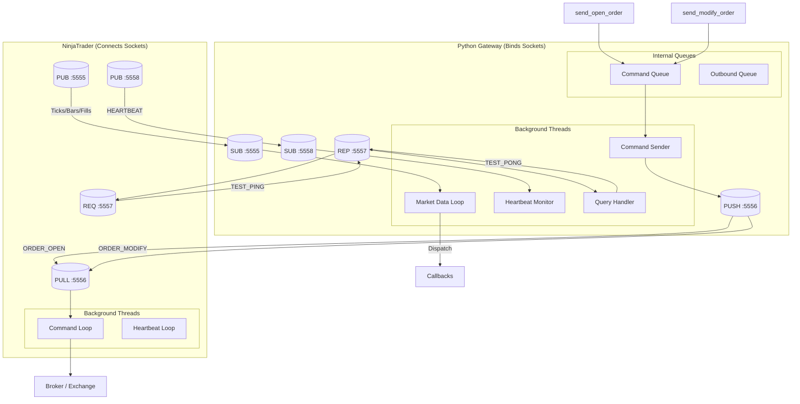
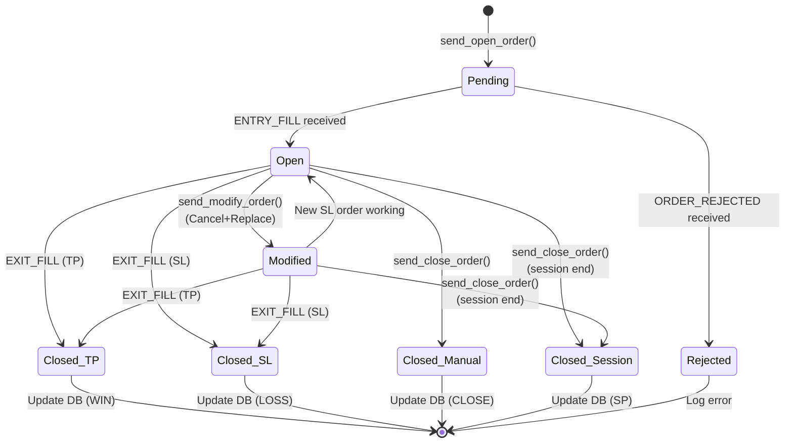
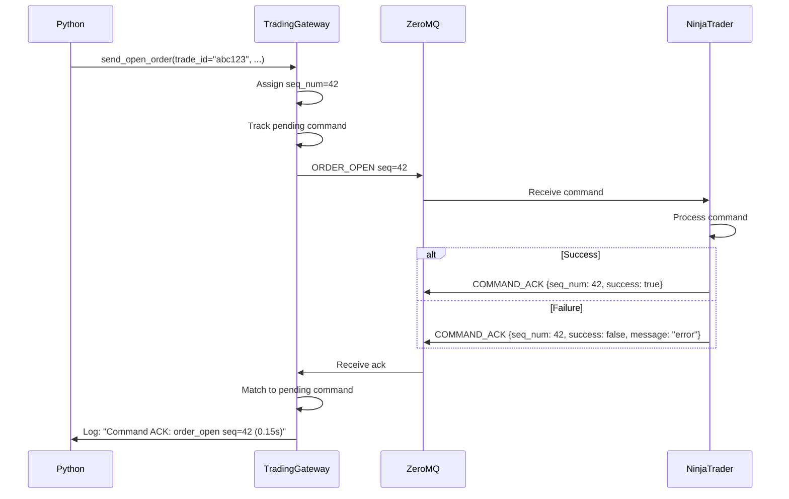
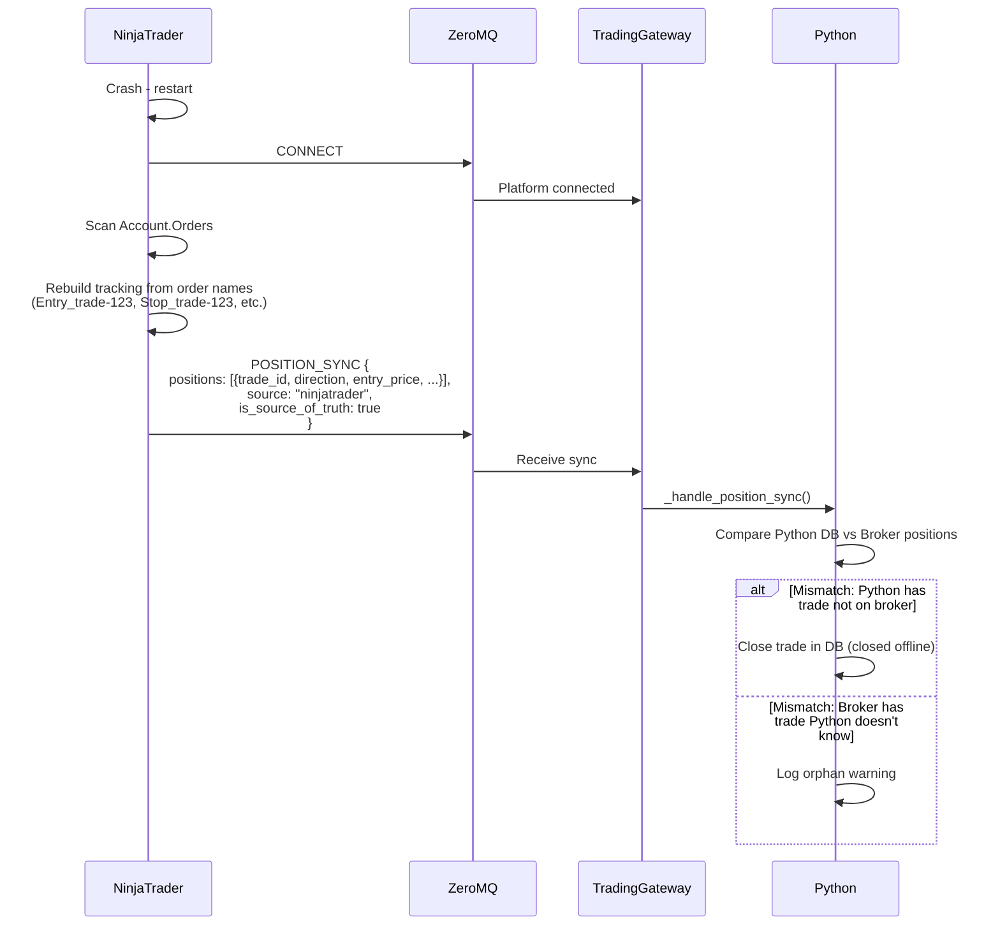

# ZeroMQ Communication Flow: Python ↔ NinjaTrader

## Socket Architecture



## Complete Trade Lifecycle: Entry → SL Update → TP Hit

```mermaid
sequenceDiagram
    autonumber
    participant PY as Python TradingBot
    participant GW as TradingGateway
    participant ZMQ as ZeroMQ
    participant NT as NinjaTrader ZMQ Connector
    participant MK as Market

    %% ===== INITIALIZATION =====
    rect rgb(230, 245, 255)
        Note over PY,MK: Connection & Market Data Setup
        NT->>ZMQ: CONNECT (msg_type: connect)
        ZMQ->>GW: Platform connected notification
        GW->>PY: on_connect callback
        NT->>ZMQ: HISTORY_BATCH (historical bars)
        ZMQ->>GW: Process history
        GW->>PY: on_history_batch callback
        NT->>ZMQ: HISTORY_END
        ZMQ->>GW: History complete
        
        loop Live Market Data Stream
            MK->>NT: Price updates
            NT->>ZMQ: TICK (price, volume, time)
            ZMQ->>GW: Market data received
            GW->>PY: on_tick callback
        end
        
        loop Heartbeat (every 5s)
            NT->>ZMQ: HEARTBEAT
            ZMQ->>GW: Update last_heartbeat_time
        end
    end

    %% ===== TRADE ENTRY =====
    rect rgb(255, 245, 230)
        Note over PY,MK: Phase 1: Trade Entry Signal (Multi-Account)
        PY->>PY: Strategy generates entry signal
        
        PY->>PY: MultiAccountExecutor expands signal<br/>per configured account (each with own rr_ratio, risk)
        
        loop For each account (e.g. Sim101, Sim102)
            PY->>GW: send_open_order(account=Sim101)
            GW->>GW: Queue ORDER_OPEN command
            
            GW->>ZMQ: ORDER_OPEN seq=42<br/>{trade_id, direction, entry_price,<br/>stop_loss, take_profit, risk_points,<br/>rr_ratio, account, risk_usd, risk_pct}
            ZMQ->>NT: Receive command
            
            NT->>NT: Resolve account by name
            NT->>NT: Validate order parameters
            NT->>NT: Check duplicate (seq_num tracking)
            NT->>MK: Submit entry market order
            MK->>NT: Order accepted
            
            NT->>ZMQ: COMMAND_ACK<br/>{command_type: "order_open",<br/>seq_num: 42, success: true}
            
            MK->>NT: Fill at entry price
            
            NT->>NT: Create bracket orders manually<br/>(Stop + Target via OCO)
            NT->>NT: Track orders in OrderTracker
            
            NT->>ZMQ: ENTRY_FILL<br/>{trade_id, entry_price, stop_loss, take_profit, account}
            ZMQ->>GW: Entry fill received
            GW->>PY: on_entry_fill callback
            
            PY->>PY: Update trade in database<br/>Status: OPEN<br/>entry_price, sl, tp stored<br/>account=Sim101
        end
    end

    %% ===== STOP LOSS UPDATE =====
    rect rgb(255, 255, 230)
        Note over PY,MK: Phase 2: Trailing Stop / Breakeven Update (Multi-Account)
        PY->>PY: Price moves in favor
        PY->>PY: Strategy decides to move SL to breakeven
        
        loop For each account trade
            PY->>GW: send_modify_order(account=Sim101)<br/>new_stop_loss = entry_price
            
            GW->>ZMQ: ORDER_MODIFY seq=43<br/>{trade_id, stop_loss, account}
            ZMQ->>NT: Receive modify command
            
            NT->>NT: Resolve account by name
            NT->>NT: Check duplicate (seq_num tracking)
            NT->>NT: Look up stop order<br/>Find by name: "Stop_{trade_id}"
            
            alt Order found
                NT->>NT: Use found order
            else Not found
                NT->>NT: ERROR - Stop order not found
                NT->>ZMQ: COMMAND_ACK {seq_num: 43, success: false}
            end
            
            NT->>NT: Validate order state<br/>(Working or Accepted)
            NT->>NT: Cancel old stop order + Create replacement<br/>at new stop price
            
            NT->>ZMQ: TRADE_LOG<br/>{trade_id, event: NT:MODIFY, message}
            ZMQ->>GW: Modification confirmed
            GW->>PY: on_trade_log callback
            PY->>PY: Log SL change in database<br/>account=Sim101
        end
    end

    %% ===== TAKE PROFIT HIT =====
    rect rgb(230, 255, 230)
        Note over PY,MK: Phase 3: Take Profit Hit (Winning Trade)
        MK->>NT: Price hits take profit level
        NT->>MK: Execute take profit order
        MK->>NT: Fill at TP price
        
        NT->>NT: Target filled — cancel working Stop order
        NT->>NT: Remove trade from OrderTracker
        
        NT->>ZMQ: EXIT_FILL<br/>{trade_id, exit_price, result_type: TP}
        ZMQ->>GW: Exit fill received
        GW->>PY: on_exit_fill callback
        
        PY->>PY: Calculate P&L<br/>(TP - Entry) × contracts × point_value
        PY->>PY: Update trade in database<br/>Status: CLOSED<br/>exit_price, result: TP
        PY->>PY: Update statistics<br/>win_count++, total_profit += pnl
    end

    %% ===== ALTERNATIVE: STOP LOSS HIT =====
    rect rgb(255, 230, 230)
        Note over PY,MK: Alternative: Stop Loss Hit (Losing Trade)
        MK->>NT: Price hits stop loss level
        NT->>MK: Execute stop loss order
        MK->>NT: Fill at SL price
        
        NT->>NT: Stop filled — cancel working Target order
        NT->>NT: Remove trade from OrderTracker
        
        NT->>ZMQ: EXIT_FILL<br/>{trade_id, exit_price, result_type: SL}
        ZMQ->>GW: Exit fill received
        GW->>PY: on_exit_fill callback
        
        PY->>PY: Calculate P&L (loss)<br/>(Entry - SL) × contracts × point_value
        PY->>PY: Update trade in database<br/>Status: CLOSED<br/>exit_price, result: SL
        PY->>PY: Update statistics<br/>loss_count++, total_loss += |pnl|
    end

    %% ===== SESSION END CLOSE =====
    rect rgb(255, 230, 200)
        Note over PY,MK: Alternative: Session End Close (Market Close)
        PY->>PY: Detect session end time (e.g., 15:00 NY)
        PY->>PY: _check_live_session_end(bar)
        
        loop For each open trade
            PY->>GW: send_close_order(account=Sim101)<br/>{trade_id, reason: "session_end"}
            GW->>ZMQ: ORDER_CLOSE<br/>{trade_id, account}
            ZMQ->>NT: Receive close command
            
            NT->>NT: Resolve account by name
            NT->>NT: Find position for instrument
            NT->>NT: Store _pendingCloseTradeId
            NT->>NT: Cancel SL/TP + Submit close market order
            NT->>MK: Market order to close
            MK->>NT: Fill at market price
            
            NT->>NT: Execution update
            NT->>NT: Detect position is flat
            NT->>ZMQ: EXIT_FILL<br/>{trade_id, exit_price, result_type: CLOSE, account}
            ZMQ->>GW: Exit fill received
            GW->>PY: on_exit_fill callback
            
            PY->>PY: Update trade in database<br/>Status: CLOSED<br/>exit_price, result_type: SP<br/>account=Sim101
            PY->>PY: Log: "SESSION_END - Trade closed"
        end
    end
```



## Multi-Account Trade Expansion

When multiple accounts are configured, a single strategy signal is expanded into **one trade per account** by `MultiAccountExecutor`. Each account trade gets its own `trade_id`, `rr_ratio`, `risk_usd`, and `risk_pct`.

### Flow



### Key Points

1. **One Signal → N Trades**: The strategy generates one signal; `MultiAccountExecutor` fans it out to every configured account
2. **Per-Account RR Ratio**: Each account's `rr_ratio` overrides the signal's default. TP is recalculated per account: `TP = entry ± (rr * risk)`
3. **Per-Account Risk**: `risk_usd` and `risk_pct` from `NtAccount` are passed through to the C# position sizing logic
4. **Independent Trade IDs**: Each account trade has its own UUID. `signal_to_accounts` and `account_to_signal` maps maintain the relationship
5. **Close/Modify Fan-Out**: When the strategy closes a signal trade, `MultiAccountExecutor` resolves it to all account trades and sends a close/modify command for each

### Python Usage

```python
from src.infrastructure.gateway.executor import MultiAccountExecutor
from src.config.models import AccountConfig

accounts = [
    AccountConfig(name="Sim101", risk_usd=100, rr_ratio=3.0),
    AccountConfig(name="Sim102", risk_usd=200, rr_ratio=5.0),
]

executor = MultiAccountExecutor(
    trade_manager=trade_manager,
    account_configs=accounts,
    gateway_executor=zmq_executor,
    logger=logger,
)

# Strategy calls executor.on_trade_open(signal_trade)
# → 2 ORDER_OPEN commands sent, one per account
```

## Stop Loss Modification Implementation

### How It Works

The `order_modify` command uses **Cancel + Replace** since `ChangeOrder()` is not available in AddOn context. Each command includes the target `account` so the connector routes to the correct NinjaTrader account.

```csharp
// 1. Python sends modification request
gateway.send_modify_order(
    trade_id="abc123",
    stop_loss=21050,
    account="Sim101"  // Required for multi-account routing
)

// 2. NinjaTrader receives ORDER_MODIFY command

// 3. Extract account from payload and resolve
var accountName = payload?["account"]?.ToString();
var account = ResolveAccount(accountName);
if (account == null)
    throw new InvalidOperationException($"No account available (requested: {accountName ?? "(default)"})");

// 4. Find the tracked stop order (or search account orders)
if (!_orderTracker.TryGetStopLoss(tradeId, out var stopOrder))
{
    stopOrder = FindStopOrderForTrade(account, tradeId);
    if (stopOrder == null)
        throw new InvalidOperationException($"Stop order not found for trade {tradeId}");
}

// 5. Queue pending modify and cancel the existing order
_orderTracker.TrackPendingModify(tradeId, new PendingModifyInfo(
    newSl, stopOrder.Instrument, stopOrder.OrderAction, stopOrder.Quantity));
_orderTracker.ExpectCancellation(stopOrder.Name);
account.Cancel(new[] { stopOrder });

// 6. OnOrderUpdate detects the cancellation and creates replacement
//    (see OnOrderUpdate in TradingBotZmqConnector.cs)

// 7. Send confirmation back to Python
_network?.SendTradeLog(trade_id, "NT:MODIFY", "Stop loss changed to 21050")
```

### ⚠️ Important: The "Gap" Risk

There's a **brief moment** (milliseconds) where **no stop loss is active** between:
1. Cancel of old stop order
2. Creation of new stop order

In fast-moving markets, the price could gap through this window. For this reason:
- Only use `modify_order` for non-critical adjustments
- Consider the risk before modifying SL near market price

### Python Usage Example

```python
from src.infrastructure.gateway import TradingGateway

gateway = TradingGateway(logger, config, pair="MNQ")
gateway.start()

# Register callback for modification confirmation
def on_trade_log(payload):
    event = payload.get('event')
    if event == 'NT:MODIFY':
        print(f"SL Modified: {payload['message']}")

gateway.on_trade_log(on_trade_log)

# After receiving entry fill...
gateway.send_modify_order(
    trade_id="trade_abc123",
    stop_loss=21050,  # Move to breakeven
    account="Sim101",  # Required for multi-account routing
)
```

## Session End Close Implementation

### Overview

When the market approaches closing time (e.g., 15:00 NY for futures), Python proactively closes all open trades to avoid overnight positions or holding through market close.

### Python Session End Detection

Located in `app_factory.py`:

```python
def _check_live_session_end(bar):
    """Send close commands to NinjaTrader when session ends."""
    if not trade_manager._session_end_time or not trade_manager._session_tz:
        return
    
    bar_dt = datetime.fromtimestamp(bar['time'], tz=trade_manager._session_tz)
    if bar_dt.time() < trade_manager._session_end_time:
        return  # Not yet session end
    
    for t in list(trade_manager.open_trades):
        if t['pair'] != bar['pair'] or t['entry_time'] > bar['time']:
            continue
        tid = t['trade_id']
        if tid not in _close_commands_sent:
            logger.info(f"[LiveMode] SESSION END — sending close_order to NT for {tid}")
            trade_manager.trade_logger.log(tid, "SESSION_END", "Sending close_order to NinjaTrader")
            trade_manager.trade_executor.on_trade_close(tid, bar['close'])
            _close_commands_sent.add(tid)
```

### Trade Executor Flow

```python
# In NinjaTraderExecutor (src/services/trade_executor.py:45)
def on_trade_close(self, trade_id, exit_price):
    self._ds.enqueue_command({
        "command": "close_order",
        "trade_id": trade_id,  # Python's trade ID identifies the order
    })
```

### NinjaTrader Order Handling

#### Order Open (Entry)

Located in `zmq_connectors/ninjatrader/Commands/OrderOpenHandler.cs`:

```csharp
public bool Handle(JObject payload)
{
    var (tradeId, direction, slPoints, rrRatio) = ParsePayload(payload);
    var accountName = payload?["account"]?.ToString();

    // Multi-account routing
    var account = ResolveAccount(accountName);
    if (account == null)
        throw new InvalidOperationException($"No account available (requested: {accountName ?? "(default)"})");

    var instrument = Instrument.GetInstrument(_instrument);
    bool isLong = direction == "long";
    int qty = CalculatePositionSize(instrument, payload, slPoints, account);

    // Create market order (name includes trade_id for recovery)
    string entryOrderName = $"Entry_{tradeId}";
    var entryOrder = account.CreateOrder(
        instrument, isLong ? OrderAction.Buy : OrderAction.SellShort,
        OrderType.Market, OrderEntry.Automated, TimeInForce.Gtc,
        qty, 0, 0, string.Empty, entryOrderName, DateTime.MinValue, null);

    _orderTracker.TrackEntry(tradeId, entryOrder);
    _orderTracker.TrackPendingEntry(tradeId, new PendingEntryInfo(direction, slPoints, rrRatio));

    account.Submit(new[] { entryOrder });

    // ENTRY_FILL sent from HandleEntryFill when fill confirmed
    // Bracket orders (SL/TP) are created manually after entry fill
}

private static Account ResolveAccount(string accountName)
{
    if (string.IsNullOrEmpty(accountName))
    {
        if (Account.All.Count == 1) return Account.All.FirstOrDefault();
        return null;
    }
    return Account.All.FirstOrDefault(a => a.Name == accountName);
}
```

#### Order Close

Located in `zmq_connectors/ninjatrader/Commands/OrderCloseHandler.cs`:

```csharp
public bool Handle(JObject payload)
{
    var tradeId = payload?["trade_id"]?.ToString();
    var accountName = payload?["account"]?.ToString();

    // Multi-account routing
    var account = ResolveAccount(accountName);
    if (account == null)
        throw new InvalidOperationException($"No account available (requested: {accountName ?? "(default)"})");

    var instrument = Instrument.GetInstrument(_instrument);

    // Cancel all working orders for this trade
    var entryOrder = FindOrderByName(account, $"Entry_{tradeId}");
    var stopOrder = FindOrderByName(account, $"Stop_{tradeId}");
    var targetOrder = FindOrderByName(account, $"Target_{tradeId}");

    if (stopOrder != null && IsWorking(stopOrder)) account.Cancel(new[] { stopOrder });
    if (targetOrder != null && IsWorking(targetOrder)) account.Cancel(new[] { targetOrder });

    // Submit closing market order for filled quantity
    bool hasFilledPosition = entryOrder != null && 
        (entryOrder.OrderState == OrderState.Filled || entryOrder.OrderState == OrderState.PartFilled);
    if (hasFilledPosition)
    {
        var closeAction = entryOrder.OrderAction == OrderAction.Buy ? OrderAction.Sell : OrderAction.BuyToCover;
        var closeOrder = account.CreateOrder(
            instrument, closeAction, OrderType.Market, OrderEntry.Automated, TimeInForce.Gtc,
            entryOrder.Filled, 0, 0, string.Empty, $"Close_{tradeId}", DateTime.MinValue, null);

        _orderTracker.TrackCloseOrder(tradeId, closeOrder);
        account.Submit(new[] { closeOrder });
    }

    // EXIT_FILL sent from HandleCloseFill when fill confirmed
}
```

**Execution Update Handler** (detects fills and sends confirmations):

Located in `zmq_connectors/ninjatrader/TradingBotZmqConnector.cs`:

```csharp
private void OnExecutionUpdate(object sender, ExecutionEventArgs e)
{
    var execution = e.Execution;
    var order = execution.Order;
    var fillPrice = execution.Price;

    string execTradeId = ExtractTradeIdFromOrderName(order.Name) ?? order.Name;
    string accountName = order.Account?.Name;

    if (IsEntryOrder(order))
    {
        HandleEntryFill(order, fillPrice);  // Creates bracket orders manually
    }
    else if (IsStopOrder(order))
    {
        HandleStopLossFill(order, fillPrice);   // Sends EXIT_FILL (SL) with account
    }
    else if (IsTargetOrder(order))
    {
        HandleTakeProfitFill(order, fillPrice); // Sends EXIT_FILL (TP) with account
    }
    else if (IsCloseOrder(order))
    {
        HandleCloseFill(order, fillPrice);      // Sends EXIT_FILL (CLOSE) with account
    }
    else
    {
        // Catch manual closes that don't match Close_{tradeId} naming
        HandlePotentialManualClose(order, fillPrice);
    }
}

// Example: Entry fill sends account back to Python
private void HandleEntryFill(Order order, double fillPrice)
{
    // ... bracket creation ...
    string accountName = account?.Name;
    _network?.SendEntryFill(tradeId, fillPrice, sl, tp, account: accountName);
}
```

### Session End vs Stream End

| Scenario | Trigger | Behavior |
|----------|---------|----------|
| **Session End** | Bar time ≥ session_end_time (e.g., 15:00) | Close trades at market price, mark as SP |
| **Stream End** | Data feed ends (no more bars) | Close remaining trades, mark as SP |

### Close Order Message Flow



### Key Points

1. **Trade ID + Account are Critical**: Python sends both `trade_id` and `account` so NinjaTrader knows exactly which position to close on which account
2. **Result Type**: Session end closes are marked as `SP` (Session Position/Stop) in the database
3. **Idempotent**: `_close_commands_sent` set prevents duplicate close commands
4. **Per-Account Order Tracking**: NinjaTracker tracks orders per account using order names (`Entry_{trade_id}`, `Stop_{trade_id}`, etc.)

## Connection Handshake & Account Routing

Account information is **no longer exchanged during the initial handshake**. Instead, the NinjaTrader connector sends a minimal `CONNECT` message, and account routing happens **per-trade** via the `account` field in every command and fill message.

### Platform Differences

| Platform | Handshake Account Info | Account Routing |
|----------|----------------------|-----------------|
| **NinjaTrader** | None — minimal `CONNECT` | Per-trade `account` field in commands & fills |
| **MetaTrader 5** | Sends broker login ID in `CONNECT` | Single account per EA instance |

### NinjaTrader Handshake Flow



### Why No Account in Handshake?

1. **Decoupling**: The connector doesn't need to know account names at connect time. It subscribes to **all** accounts and routes each incoming command to the correct one.
2. **Dynamic accounts**: Accounts can be added/removed in Python's web admin without restarting NinjaTrader.
3. **Simpler reconnection**: After a crash/reconnect, there's no dependency on config query timing.

### Python Side — Account Configuration

Accounts are configured in the web admin (Settings tab) and stored in the `nt_accounts` SQLite table. `DbConfigLoader` reads them at startup and `MultiAccountExecutor` expands each signal into per-account trades.

```python
from src.config.loaders import DbConfigLoader
from src.infrastructure.gateway.executor import MultiAccountExecutor

cfg = DbConfigLoader().load()  # Reads AppSetting + NtAccount from DB
account_configs = cfg.nt_accounts  # List[AccountConfig]

# MultiAccountExecutor expands one signal into N per-account trades
trade_executor = MultiAccountExecutor(
    trade_manager=trade_manager,
    account_configs=account_configs,
    gateway_executor=zmq_executor,
    logger=logger,
)
```

### NinjaTrader Side — Minimal Connect

```csharp
// In Connect() method
_network.Start();
Thread.Sleep(300);  // Slow joiner protection

// Subscribe to ALL accounts — no config query needed
foreach (var acct in Account.All)
{
    acct.ExecutionUpdate += OnExecutionUpdate;
    acct.OrderUpdate += OnOrderUpdate;
}

// Send minimal connect handshake (account name is not needed)
_network.SendConnect("ninjatrader", _config.PlatformVersion, pair: _config.Instrument.Split(' ')[0]);

// Restore order tracking and report positions for crash recovery
foreach (var acct in Account.All)
{
    _orderTracker.RestoreFromBrokerOrders(acct, _logger);
}
ReportPositionsToPython();
```

### Per-Trade Account Routing

Every command from Python includes the target `account`. The NinjaTrader handler resolves it at execution time:

```csharp
// In OrderOpenHandler, OrderCloseHandler, OrderModifyHandler
var accountName = payload?["account"]?.ToString();
var account = ResolveAccount(accountName);
if (account == null)
    throw new InvalidOperationException($"No account available (requested: {accountName ?? "(default)"})");

private static Account ResolveAccount(string accountName)
{
    if (string.IsNullOrEmpty(accountName))
    {
        if (Account.All.Count == 1) return Account.All.FirstOrDefault();
        return null;
    }
    return Account.All.FirstOrDefault(a => a.Name == accountName);
}
```

### Fallback Behavior

If a command arrives without an `account` field:
1. If only **one** account is connected in NinjaTrader, it is used automatically.
2. If **multiple** accounts are connected, the command fails with `"No account available (requested: (default))"`.

If a specified account is not found:
1. The command fails immediately with `"No account available (requested: 'XYZ')"`.
2. No fallback to `Account.All[0]` occurs — commands must explicitly target a valid account when multiple accounts exist.

### MetaTrader 5 Handshake (Legacy Behavior)

MetaTrader 5 still queries config and sends the account in `CONNECT`:

```mql5
// Query config from Python (account name, etc.)
string configuredAccount = _network.QueryConfig("account", 2000);

// Send connect handshake
_network.SendConnect("metatrader5", _config.platformVersion, configuredAccount, _Symbol);
```

> **Note**: MT5 queries `"account"` (singular), but Python's `CONFIG_QUERY` handler only responds to `"accounts"` or `"all"`. This causes the query to return empty, and MT5 falls back to the broker login ID (`AccountInfoInteger(ACCOUNT_LOGIN)`).

## Message Types Reference

### Python → NinjaTrader (Commands via PUSH/PULL)

| Message Type | Payload Fields | Description |
|-------------|----------------|-------------|
| `order_open` | trade_id, direction, entry_price, stop_loss, take_profit, risk_points, rr_ratio, **account**, **risk_usd**, **risk_pct** | Open new position on specified account |
| `order_close` | trade_id, reason, **account** | Close position on specified account |
| `order_modify` | trade_id, stop_loss, take_profit, **account** | Modify SL/TP on specified account via Cancel+Replace (⚠️ brief gap risk) |
| `refresh_request` | days | Request historical data refresh |

### NinjaTrader → Python (Market Data via PUB/SUB)

| Message Type | Payload Fields | Description |
|-------------|----------------|-------------|
| `tick` | pair, price, volume, time, bid, ask | Live price update |
| `bar` | pair, time, open, high, low, close, volume | Completed bar |
| `history_batch` | pair, bars[], days | Historical bars batch |
| `history_end` | - | End of history transmission |
| `entry_fill` | trade_id, entry_price, stop_loss, take_profit, **account** | Entry execution |
| `exit_fill` | trade_id, exit_price, result_type, **account** | Exit execution (TP/SL/CLOSE/SP) |
| `trade_log` | trade_id, event, message | Trading events log |
| `heartbeat` | source, status | Health check (every 5s) |
| `connect` | platform, version, account (optional), pair | Initial handshake. **NT**: no account sent. **MT5**: sends broker login ID |
| `error` | source, error_type, message, details | Error notification |
| `command_ack` | command_type, seq_num, success, trade_id, message | Command acknowledgment |
| `position_sync` | positions[], count, source, is_source_of_truth | Crash recovery sync |

### Bidirectional Queries (via REQ/REP)

| Message Type | Direction | Payload Fields | Description |
|-------------|-----------|----------------|-------------|
| `test_ping` | NT → PY | timestamp | Connection test |
| `test_pong` | PY → NT | timestamp | Connection test response |
| `position_query` | NT → PY | - | Query open positions for recovery |
| `position_response` | PY → NT | positions[], count | Open positions list |
| `config_query` | NT → PY | key | Query config value. **Used by MT5** (queries `"account"`). **Not used by NT** |
| `config_response` | PY → NT | {key: value} | Config value response. Python handles `"accounts"` / `"all"` keys |

## Socket Flow Details



## Trade State Machine



## Command Acknowledgment

Every command sent from Python to NinjaTrader receives an acknowledgment (`command_ack`) confirming receipt and processing status.

### Ack Flow



### Python Command Tracking

```python
# Commands are tracked until acknowledged or timeout
gateway.send_open_order(
    trade_id="abc123",
    direction="long",
    entry_price=21000,
    stop_loss=20950,
    take_profit=21250,
    risk_points=50,
    rr_ratio=5.0,
    account="Sim101",  // Required for multi-account routing
)
# Logs: "Queued OPEN order: abc123"

# When ack received:
# "✅ Command ACK: order_open seq=42 trade=abc123 (0.15s)"

# If timeout (60 seconds):
# "⚠️ Command timed out waiting for ack: order_open seq=42"
```

## Duplicate Command Detection

NinjaTrader tracks processed sequence numbers to prevent double-execution:

```csharp
// In CommandLoop()
if (_processedSeqNums.Contains(envelope.SeqNum))
{
    _logger.Warning($"Duplicate command ignored: seq={envelope.SeqNum}");
    _network?.SendCommandAck(..., message: "duplicate");
    return;
}
```

This prevents issues if Python retries a command due to network delay.

## Crash Recovery Sync

When NinjaTrader reconnects after a crash, it reports actual broker positions to Python for reconciliation.

### Recovery Flow



### Order Naming Convention

Orders MUST include `trade_id` in their names for recovery:

| Order Type | Name Format | Example |
|-----------|-------------|---------|
| Entry | `Entry_{trade_id}` | `Entry_abc123` |
| Stop Loss | `Stop_{trade_id}` | `Stop_abc123` |
| Take Profit | `Target_{trade_id}` | `Target_abc123` |
| Close | `Close_{trade_id}` | `Close_abc123` |

If an order arrives without trade_id in the name:
```
CRITICAL: Stop order 'Stop' has no trade_id in name - cannot track!
```

## Error Handling

| Scenario | Behavior |
|----------|----------|
| Stop order not found | Searches Account.Orders by name `Stop_{trade_id}`, errors if not found |
| Modify order gap risk | Warning logged: Brief gap between cancel and new order |
| Order not modifiable (Filled/Cancelled) | Error: "Stop order not modifiable" |
| Modify replacement failed | Error logged + sent to Python via TRADE_LOG |
| Account not connected | Error: "No account available" |
| Position not found for close | Error: "Trade not tracked — already closed or never opened" |
| Close order fails | Error sent via TRADE_LOG, position may remain open |
| Order without trade_id in name | CRITICAL error logged, tracking failed |
| Fill received but order not tracked | CRITICAL error logged, cannot process fill |

## Port Configuration

| Port | Socket Type | Direction | Purpose |
|------|-------------|-----------|---------|
| 5555 | PUB/SUB | NT → Python | Market data (ticks, bars, fills) |
| 5556 | PUSH/PULL | Python → NT | Trading commands |
| 5557 | REQ/REP | Bidirectional | Synchronous queries |
| 5558 | PUB/SUB | NT → Python | Heartbeats |
