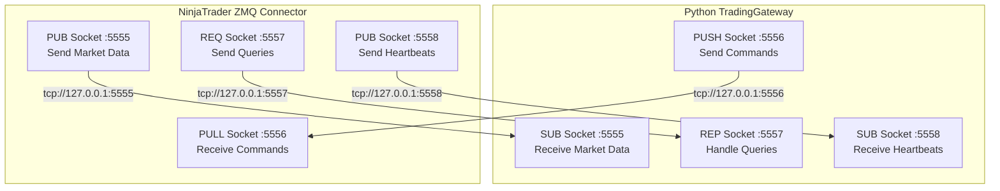
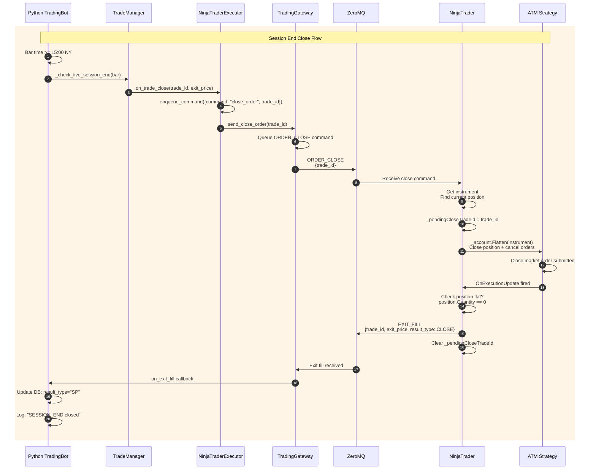
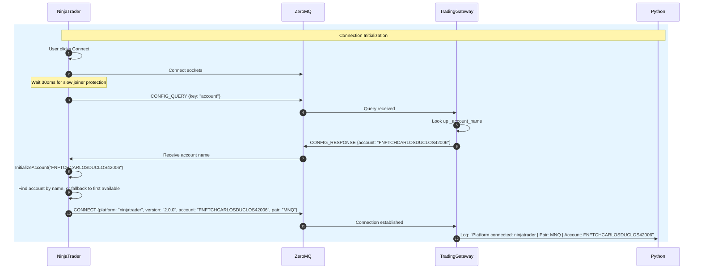
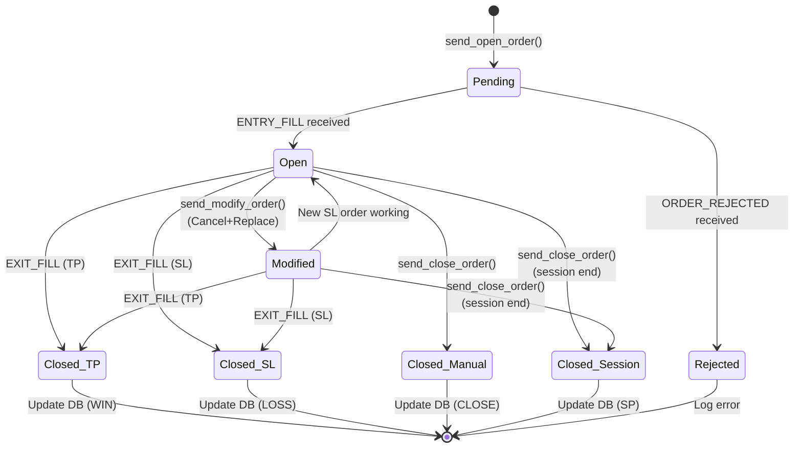
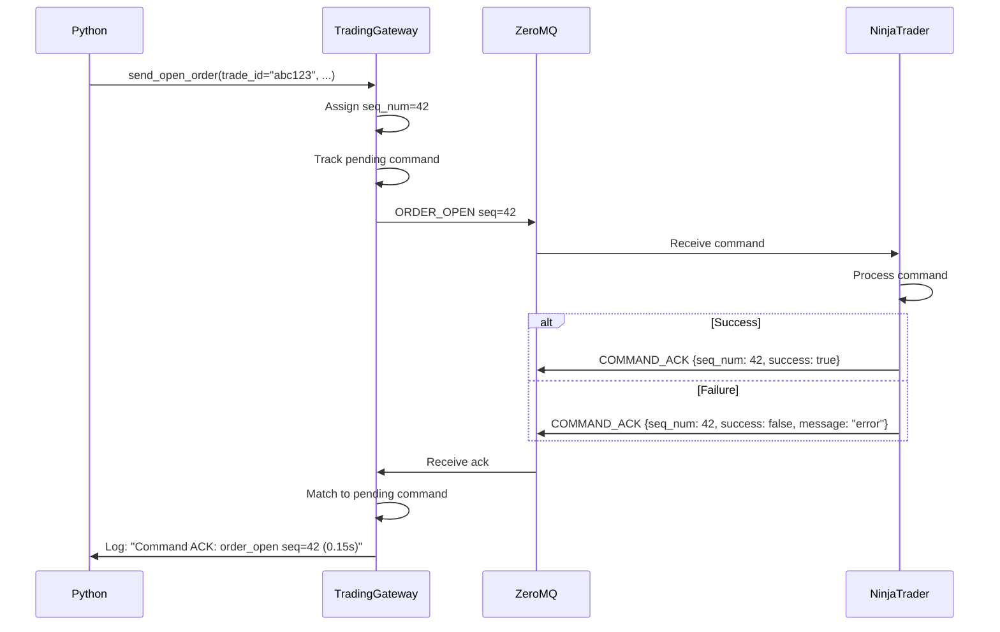
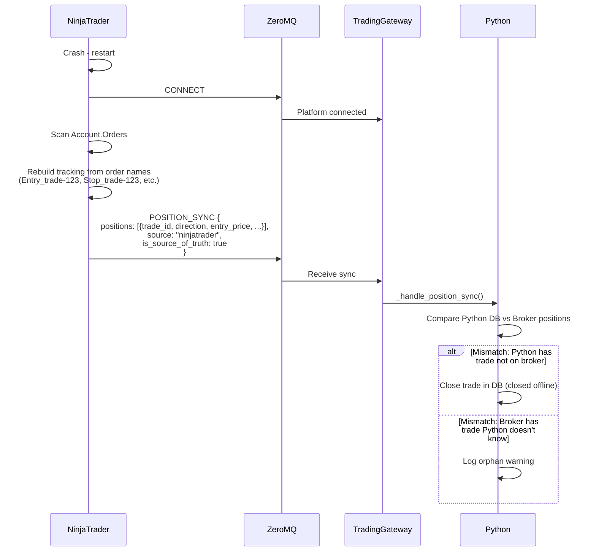

# ZeroMQ Communication Flow: Python ↔ NinjaTrader

## Socket Architecture



## Complete Trade Lifecycle: Entry → SL Update → TP Hit

```mermaid
sequenceDiagram
    autonumber
    participant PY as Python TradingBot
    participant GW as TradingGateway
    participant ZMQ as ZeroMQ
    participant NT as NinjaTrader ZMQ Connector
    participant ATM as ATM Strategy
    participant MK as Market

    %% ===== INITIALIZATION =====
    rect rgb(230, 245, 255)
        Note over PY,MK: Connection & Market Data Setup
        NT->>ZMQ: CONNECT (msg_type: connect)
        ZMQ->>GW: Platform connected notification
        GW->>PY: on_connect callback
        NT->>ZMQ: HISTORY_BATCH (historical bars)
        ZMQ->>GW: Process history
        GW->>PY: on_history_batch callback
        NT->>ZMQ: HISTORY_END
        ZMQ->>GW: History complete
        
        loop Live Market Data Stream
            MK->>NT: Price updates
            NT->>ZMQ: TICK (price, volume, time)
            ZMQ->>GW: Market data received
            GW->>PY: on_tick callback
        end
        
        loop Heartbeat (every 5s)
            NT->>ZMQ: HEARTBEAT
            ZMQ->>GW: Update last_heartbeat_time
        end
    end

    %% ===== TRADE ENTRY =====
    rect rgb(255, 245, 230)
        Note over PY,MK: Phase 1: Trade Entry Signal
        PY->>PY: Strategy generates entry signal
        PY->>GW: send_open_order()
        GW->>GW: Queue ORDER_OPEN command
        
        GW->>ZMQ: ORDER_OPEN seq=42<br/>{trade_id, direction, entry_price,<br/>stop_loss, take_profit, risk_points}
        ZMQ->>NT: Receive command
        
        NT->>NT: Validate order parameters
        NT->>NT: Check duplicate (seq_num tracking)
        NT->>ATM: Create market order + Start ATM Strategy
        
        ATM->>NT: Order created
        NT->>ZMQ: COMMAND_ACK<br/>{command_type: "order_open",<br/>seq_num: 42, success: true}
        ATM->>MK: Submit entry order
        MK->>ATM: Fill at entry price
        
        ATM->>ATM: Auto-create Stop Loss order
        ATM->>ATM: Auto-create Take Profit order
        
        ATM->>NT: Entry filled notification
        NT->>NT: Track SL order in _stopLossOrders[trade_id]
        NT->>ZMQ: ENTRY_FILL<br/>{trade_id, entry_price, stop_loss, take_profit}
        ZMQ->>GW: Entry fill received
        GW->>PY: on_entry_fill callback
        
        PY->>PY: Update trade in database<br/>Status: OPEN<br/>entry_price, sl, tp stored
    end

    %% ===== STOP LOSS UPDATE =====
    rect rgb(255, 255, 230)
        Note over PY,MK: Phase 2: Trailing Stop / Breakeven Update
        PY->>PY: Price moves in favor
        PY->>PY: Strategy decides to move SL to breakeven
        PY->>GW: send_modify_order()<br/>new_stop_loss = entry_price
        
        GW->>ZMQ: ORDER_MODIFY seq=43<br/>{trade_id, stop_loss}
        ZMQ->>NT: Receive modify command
        
        NT->>NT: Check duplicate (seq_num tracking)
        NT->>NT: Look up stop order<br/>Find by name: "Stop_{trade_id}"
        
        alt Order found
            NT->>NT: Use found order
        else Not found
            NT->>NT: ERROR - Stop order not found
            NT->>ZMQ: COMMAND_ACK {seq_num: 43, success: false}
        end
        
        NT->>NT: Validate order state<br/>(Working or Accepted)
        NT->>ATM: _account.ChangeOrder()<br/>Update stop price
        ATM->>MK: Modify stop order
        
        NT->>ZMQ: TRADE_LOG<br/>{trade_id, event: NT:MODIFY, message}
        ZMQ->>GW: Modification confirmed
        GW->>PY: on_trade_log callback
        PY->>PY: Log SL change in database
    end

    %% ===== TAKE PROFIT HIT =====
    rect rgb(230, 255, 230)
        Note over PY,MK: Phase 3: Take Profit Hit (Winning Trade)
        MK->>ATM: Price hits take profit level
        ATM->>MK: Execute take profit order
        MK->>ATM: Fill at TP price
        
        ATM->>ATM: Auto-cancel Stop Loss order
        ATM->>ATM: Close ATM strategy
        
        ATM->>NT: Target filled notification
        NT->>ZMQ: EXIT_FILL<br/>{trade_id, exit_price, result_type: TP}
        ZMQ->>GW: Exit fill received
        GW->>PY: on_exit_fill callback
        
        PY->>PY: Calculate P&L<br/>(TP - Entry) × contracts × point_value
        PY->>PY: Update trade in database<br/>Status: CLOSED<br/>exit_price, result: TP
        PY->>PY: Update statistics<br/>win_count++, total_profit += pnl
    end

    %% ===== ALTERNATIVE: STOP LOSS HIT =====
    rect rgb(255, 230, 230)
        Note over PY,MK: Alternative: Stop Loss Hit (Losing Trade)
        MK->>ATM: Price hits stop loss level
        ATM->>MK: Execute stop loss order
        MK->>ATM: Fill at SL price
        
        ATM->>ATM: Auto-cancel Take Profit order
        ATM->>ATM: Close ATM strategy
        
        ATM->>NT: Stop filled notification
        NT->>ZMQ: EXIT_FILL<br/>{trade_id, exit_price, result_type: SL}
        ZMQ->>GW: Exit fill received
        GW->>PY: on_exit_fill callback
        
        PY->>PY: Calculate P&L (loss)<br/>(Entry - SL) × contracts × point_value
        PY->>PY: Update trade in database<br/>Status: CLOSED<br/>exit_price, result: SL
        PY->>PY: Update statistics<br/>loss_count++, total_loss += |pnl|
    end

    %% ===== SESSION END CLOSE =====
    rect rgb(255, 230, 200)
        Note over PY,MK: Alternative: Session End Close (Market Close)
        PY->>PY: Detect session end time (e.g., 15:00 NY)
        PY->>PY: _check_live_session_end(bar)
        
        loop For each open trade
            PY->>GW: send_close_order()<br/>{trade_id, reason: "session_end"}
            GW->>ZMQ: ORDER_CLOSE<br/>{trade_id}
            ZMQ->>NT: Receive close command
            
            NT->>NT: Find position for instrument
            NT->>NT: Store _pendingCloseTradeId
            NT->>ATM: _account.Flatten()<br/>Cancel SL/TP + Close position
            ATM->>MK: Market order to close
            MK->>ATM: Fill at market price
            
            ATM->>NT: Execution update
            NT->>NT: Detect position is flat
            NT->>ZMQ: EXIT_FILL<br/>{trade_id, exit_price, result_type: CLOSE}
            ZMQ->>GW: Exit fill received
            GW->>PY: on_exit_fill callback
            
            PY->>PY: Update trade in database<br/>Status: CLOSED<br/>exit_price, result_type: SP
            PY->>PY: Log: "SESSION_END - Trade closed"
        end
    end
```



## Stop Loss Modification Implementation

### How It Works

The `order_modify` command uses **Cancel + Replace** since `ChangeOrder()` is not available in AddOn context:

```csharp
// 1. Python sends modification request
gateway.send_modify_order(trade_id="abc123", stop_loss=21050)

// 2. NinjaTrader receives ORDER_MODIFY command

// 3. Find the tracked stop order
Order stopOrder = _stopLossOrders[trade_id];

// 4. Cancel the existing order
_account.Cancel(stopOrder);

// 5. Create new stop order at new price
Order newStopOrder = _account.CreateOrder(
    instrument: stopOrder.Instrument,
    orderAction: stopOrder.OrderAction,
    orderType: OrderType.StopMarket,
    stopPrice: newSl  // New stop price
);

// 6. Track the new order
_stopLossOrders[trade_id] = newStopOrder;

// 7. Send confirmation back to Python
_network?.SendTradeLog(trade_id, "NT:MODIFY", "Stop loss changed to 21050")
```

### ⚠️ Important: The "Gap" Risk

There's a **brief moment** (milliseconds) where **no stop loss is active** between:
1. Cancel of old stop order
2. Creation of new stop order

In fast-moving markets, the price could gap through this window. For this reason:
- Use ATM strategy's built-in breakeven for safer SL management
- Only use `modify_order` for non-critical adjustments
- Consider the risk before modifying SL near market price

### Code Changes

**Added to OrderManager class:**

```csharp
// Track stop loss orders for modification capability
private readonly Dictionary<string, Order> _stopLossOrders = 
    new Dictionary<string, Order>();

// Updated OnOrderUpdate to track stop orders
private void OnOrderUpdate(object sender, OrderEventArgs e)
{
    var order = e.Order;
    
    // Track stop loss orders
    if ((order.Name == "Stop" || order.Name.Contains("Stop")) && 
        (order.OrderType == OrderType.StopMarket || order.OrderType == OrderType.StopLimit))
    {
        var tradeId = FindTradeIdByAtmOrder(order);
        if (tradeId != null)
        {
            _stopLossOrders[tradeId] = order;
            _log($"TRACKING SL order for {trade_id}");
        }
    }
}

// New HandleModifyOrder implementation
internal void HandleModifyOrder(string body)
{
    var tradeId = JsonHelper.ExtractString(body, "trade_id");
    var newSl = JsonHelper.ExtractDouble(body, "stop_loss");
    
    // Get cached or find stop order
    Order stopOrder;
    if (!_stopLossOrders.TryGetValue(tradeId, out stopOrder))
    {
        stopOrder = FindStopOrderForTrade(tradeId); // Search account
    }
    
    // Validate state
    if (stopOrder.OrderState != Working && stopOrder.OrderState != Accepted)
        return error;
    
    // Modify via NinjaTrader API
    _account.ChangeOrder(stopOrder, qty, limitPrice, newSl, atmStrategyId);
}
```

### Python Usage Example

```python
from src.gateway import TradingGateway

gateway = TradingGateway(logger, config, pair="MNQ")
gateway.start()

# Register callback for modification confirmation
def on_trade_log(payload):
    event = payload.get('event')
    if event == 'NT:MODIFY':
        print(f"SL Modified: {payload['message']}")

gateway.on_trade_log(on_trade_log)

# After receiving entry fill...
gateway.send_modify_order(
    trade_id="trade_abc123",
    stop_loss=21050  # Move to breakeven
)
```

## Session End Close Implementation

### Overview

When the market approaches closing time (e.g., 15:00 NY for futures), Python proactively closes all open trades to avoid overnight positions or holding through market close.

### Python Session End Detection

Located in `app_factory.py`:

```python
def _check_live_session_end(bar):
    """Send close commands to NinjaTrader when session ends."""
    if not trade_manager._session_end_time or not trade_manager._session_tz:
        return
    
    bar_dt = datetime.fromtimestamp(bar['time'], tz=trade_manager._session_tz)
    if bar_dt.time() < trade_manager._session_end_time:
        return  # Not yet session end
    
    for t in list(trade_manager.open_trades):
        if t['pair'] != bar['pair'] or t['entry_time'] > bar['time']:
            continue
        tid = t['trade_id']
        if tid not in _close_commands_sent:
            logger.info(f"[LiveMode] SESSION END — sending close_order to NT for {tid}")
            trade_manager.trade_logger.log(tid, "SESSION_END", "Sending close_order to NinjaTrader")
            trade_manager.trade_executor.on_trade_close(tid, bar['close'])
            _close_commands_sent.add(tid)
```

### Trade Executor Flow

```python
# In NinjaTraderExecutor (src/services/trade_executor.py:45)
def on_trade_close(self, trade_id, exit_price):
    self._ds.enqueue_command({
        "command": "close_order",
        "trade_id": trade_id,  # Python's trade ID identifies the order
    })
```

### NinjaTrader Order Handling

#### Order Open (Entry)

Located in `zmq_connectors/ninjatrader/TradingBotZmqConnector.cs`:

```csharp
private void HandleOpenOrder(JObject payload)
{
    var tradeId = payload["trade_id"]?.ToString();
    var direction = payload["direction"]?.ToString();  // "long" or "short"
    var slPoints = payload["risk_points"]?.Value<double>() ?? 0;
    var rrRatio = payload["rr_ratio"]?.Value<double>() ?? 2.0;
    
    // Position sizing based on risk
    double riskUsd = payload["risk_usd"]?.Value<double>() ?? 0;
    double riskPct = payload["risk_pct"]?.Value<double>() ?? 0;
    int qty = CalculatePositionSize(riskUsd, riskPct, slPoints);
    
    // Get ATM strategy based on SL points
    string atmStrategyName = GetAtmStrategyName(slPoints);
    // slPoints <= 15 -> "TA_MNQ_15pt"
    // slPoints <= 20 -> "TA_MNQ_20pt"
    // slPoints <= 30 -> "TA_MNQ_30pt"
    // else -> "TA_MNQ_40pt"
    
    // Create market order (name MUST be "Entry" for ATM)
    var entryOrder = _account.CreateOrder(
        instrument,
        isLong ? OrderAction.Buy : OrderAction.SellShort,
        OrderType.Market,
        OrderEntry.Automated,
        TimeInForce.Gtc,
        qty,
        0, 0,
        string.Empty,
        "Entry",  // CRITICAL: Must be exactly "Entry"
        DateTime.MinValue,
        null);
    
    // Start ATM strategy - auto-manages SL/TP
    NinjaTrader.NinjaScript.AtmStrategy.StartAtmStrategy(atmStrategyName, entryOrder);
    
    // Track pending entry
    _pendingEntries[tradeId] = new PendingEntry {
        Direction = direction,
        SlPoints = slPoints,
        RrRatio = rrRatio,
        AtmStrategyName = atmStrategyName
    };
    _tradeIdToAtmStrategy[tradeId] = atmStrategyName;
    
    // ENTRY_FILL sent from OnExecutionUpdate when fill confirmed
}
```

#### Order Close

```csharp
private void HandleCloseOrder(JObject payload)
{
    var tradeId = payload["trade_id"]?.ToString();
    
    // Store pending close info
    _pendingCloseTradeId = tradeId;
    
    // Flatten the position - ATM strategy closes automatically
    _account.Flatten(new[] { instrument });
    
    // Clean up tracking
    _stopLossOrders.Remove(tradeId);
    _tradeIdToAtmStrategy.Remove(tradeId);
    
    // EXIT_FILL sent from OnExecutionUpdate when fill confirmed
}
```

**Execution Update Handler** (detects fills and sends confirmations):

```csharp
private void OnExecutionUpdate(object sender, ExecutionEventArgs e)
{
    var execution = e.Execution;
    var orderName = execution.Order.Name;  // "Entry", "Stop", "Target"
    var fillPrice = execution.Price;
    
    // ENTRY FILL: Entry order filled
    if (orderName == "Entry")
    {
        // Find trade_id by ATM strategy
        var tradeId = FindTradeIdByAtmStrategy(execution.Order.AtmStrategyId);
        var entry = _pendingEntries[tradeId];
        
        // Calculate SL/TP based on actual fill price
        double sl = entry.Direction == "long" 
            ? fillPrice - entry.SlPoints 
            : fillPrice + entry.SlPoints;
        double tp = entry.Direction == "long"
            ? fillPrice + (entry.SlPoints * entry.RrRatio)
            : fillPrice - (entry.SlPoints * entry.RrRatio);
        
        // Send entry fill to Python
        _network?.SendEntryFill(tradeId, fillPrice, sl, tp);
    }
    
    // SL/TP FILL: Stop or Target order filled
    else if (orderName.Contains("Stop") || orderName.Contains("Target"))
    {
        var tradeId = FindTradeIdByAtmStrategy(execution.Order.AtmStrategyId);
        var resultType = orderName.Contains("Stop") ? "SL" : "TP";
        
        _network?.SendExitFill(tradeId, fillPrice, resultType);
        
        // Clean up tracking
        _pendingEntries.Remove(tradeId);
        _stopLossOrders.Remove(tradeId);
        _tradeIdToAtmStrategy.Remove(tradeId);
    }
    
    // MANUAL CLOSE: Position flattened
    else if (!string.IsNullOrEmpty(_pendingCloseTradeId))
    {
        // Check if position is now flat
        var position = GetCurrentPosition();
        if (position == null || position.Quantity == 0)
        {
            _network?.SendExitFill(_pendingCloseTradeId, fillPrice, "CLOSE");
            
            // Clean up and clear pending close
            _pendingEntries.Remove(_pendingCloseTradeId);
            _pendingCloseTradeId = null;
        }
    }
}
```

### Session End vs Stream End

| Scenario | Trigger | Behavior |
|----------|---------|----------|
| **Session End** | Bar time ≥ session_end_time (e.g., 15:00) | Close trades at market price, mark as SP |
| **Stream End** | Data feed ends (no more bars) | Close remaining trades, mark as SP |

### Close Order Message Flow



### Key Points

1. **Trade ID is Critical**: Same as SL updates, Python sends its `trade_id` so NinjaTrader knows which position to close
2. **Result Type**: Session end closes are marked as `SP` (Session Position/Stop) in the database
3. **Idempotent**: `_close_commands_sent` set prevents duplicate close commands
4. **ATM Strategy Tracking**: NinjaTrader maintains `_tradeIdToAtmStrategy` dictionary to map Python's trade_id to the actual ATM strategy

## Account Configuration Flow

NinjaTrader queries the account name from Python during connection initialization. This allows the account to be specified in `start_live.sh` (via `NT_ACCOUNT`) rather than hardcoded in the NinjaTrader code.

### Flow



### Python Side

```python
# In app.py or start_live.sh
export NT_ACCOUNT="FNFTCHCARLOSDUCLOS42006"

# In create_live_components()
gateway._account_name = account  # Stored for config queries
```

### NinjaTrader Side

```csharp
// In Connect() method
_network.Start();
Thread.Sleep(300);  // Slow joiner protection

// Query account from Python
string configuredAccount = _network.QueryConfig("account");
if (!string.IsNullOrEmpty(configuredAccount))
{
    _logger.Info($"Python specified account: {configuredAccount}");
}

// Send connect with account info
_network.SendConnect("ninjatrader", _config.PlatformVersion, 
    account: configuredAccount, pair: "MNQ");

// Initialize using specified account
InitializeAccount(configuredAccount);
```

### Fallback Behavior

If Python doesn't specify an account (or query fails):
1. NinjaTrader logs: "No account specified by Python, using first available"
2. Uses `Account.All[0]` (first account in NinjaTrader)

If specified account is not found:
1. NinjaTrader logs: "Account 'XYZ' not found, using first available"
2. Falls back to `Account.All[0]`

## Message Types Reference

### Python → NinjaTrader (Commands via PUSH/PULL)

| Message Type | Payload Fields | Description |
|-------------|----------------|-------------|
| `order_open` | trade_id, direction, entry_price, stop_loss, take_profit, risk_points, rr_ratio | Open new position with ATM strategy |
| `order_close` | trade_id, reason | Close position (flatten) |
| `order_modify` | trade_id, stop_loss, take_profit | Modify SL via Cancel+Replace (⚠️ brief gap risk) |
| `refresh_request` | days | Request historical data refresh |

### NinjaTrader → Python (Market Data via PUB/SUB)

| Message Type | Payload Fields | Description |
|-------------|----------------|-------------|
| `tick` | pair, price, volume, time, bid, ask | Live price update |
| `bar` | pair, time, open, high, low, close, volume | Completed bar |
| `history_batch` | pair, bars[], days | Historical bars batch |
| `history_end` | - | End of history transmission |
| `entry_fill` | trade_id, entry_price, stop_loss, take_profit | Entry execution |
| `exit_fill` | trade_id, exit_price, result_type | Exit execution (TP/SL/CLOSE/SP) |
| `trade_log` | trade_id, event, message | Trading events log |
| `heartbeat` | source, status | Health check (every 5s) |
| `connect` | platform, version, account, pair | Initial handshake |
| `error` | source, error_type, message, details | Error notification |
| `command_ack` | command_type, seq_num, success, trade_id, message | Command acknowledgment |
| `position_sync` | positions[], count, source, is_source_of_truth | Crash recovery sync |

### Bidirectional Queries (via REQ/REP)

| Message Type | Direction | Payload Fields | Description |
|-------------|-----------|----------------|-------------|
| `test_ping` | NT → PY | timestamp | Connection test |
| `test_pong` | PY → NT | timestamp | Connection test response |
| `position_query` | NT → PY | - | Query open positions for recovery |
| `position_response` | PY → NT | positions[], count | Open positions list |
| `config_query` | NT → PY | key | Query config value (account, etc.) |
| `config_response` | PY → NT | {key: value} | Config value response |

## Socket Flow Details


## Trade State Machine



## Command Acknowledgment

Every command sent from Python to NinjaTrader receives an acknowledgment (`command_ack`) confirming receipt and processing status.

### Ack Flow



### Python Command Tracking

```python
# Commands are tracked until acknowledged or timeout
gateway.send_open_order(trade_id="abc123", ...)
# Logs: "Queued OPEN order: abc123"

# When ack received:
# "✅ Command ACK: order_open seq=42 trade=abc123 (0.15s)"

# If timeout (60 seconds):
# "⚠️ Command timed out waiting for ack: order_open seq=42"
```

## Duplicate Command Detection

NinjaTrader tracks processed sequence numbers to prevent double-execution:

```csharp
// In CommandLoop()
if (_processedSeqNums.Contains(envelope.SeqNum))
{
    _logger.Warning($"Duplicate command ignored: seq={envelope.SeqNum}");
    _network?.SendCommandAck(..., message: "duplicate");
    return;
}
```

This prevents issues if Python retries a command due to network delay.

## Crash Recovery Sync

When NinjaTrader reconnects after a crash, it reports actual broker positions to Python for reconciliation.

### Recovery Flow



### Order Naming Convention

Orders MUST include `trade_id` in their names for recovery:

| Order Type | Name Format | Example |
|-----------|-------------|---------|
| Entry | `Entry_{trade_id}` | `Entry_abc123` |
| Stop Loss | `Stop_{trade_id}` | `Stop_abc123` |
| Take Profit | `Target_{trade_id}` | `Target_abc123` |
| Close | `Close_{trade_id}` | `Close_abc123` |

If an order arrives without trade_id in the name:
```
CRITICAL: Stop order 'Stop' has no trade_id in name - cannot track!
```

## Error Handling

| Scenario | Behavior |
|----------|----------|
| Stop order not found | Searches Account.Orders by name `Stop_{trade_id}`, errors if not found |
| Modify order gap risk | Warning logged: Brief gap between cancel and new order |
| Order not modifiable (Filled/Cancelled) | Error: "Stop order not modifiable" |
| ChangeOrder exception | Error logged + sent to Python via TRADE_LOG |
| Account not connected | Error: "No account available" |
| Position not found for close | Error: "No ATM strategy found for trade_id" |
| Close order fails | Error sent via TRADE_LOG, position may remain open |
| Order without trade_id in name | CRITICAL error logged, tracking failed |
| Fill received but order not tracked | CRITICAL error logged, cannot process fill |

## Port Configuration

| Port | Socket Type | Direction | Purpose |
|------|-------------|-----------|---------|
| 5555 | PUB/SUB | NT → Python | Market data (ticks, bars, fills) |
| 5556 | PUSH/PULL | Python → NT | Trading commands |
| 5557 | REQ/REP | Bidirectional | Synchronous queries |
| 5558 | PUB/SUB | NT → Python | Heartbeats |
